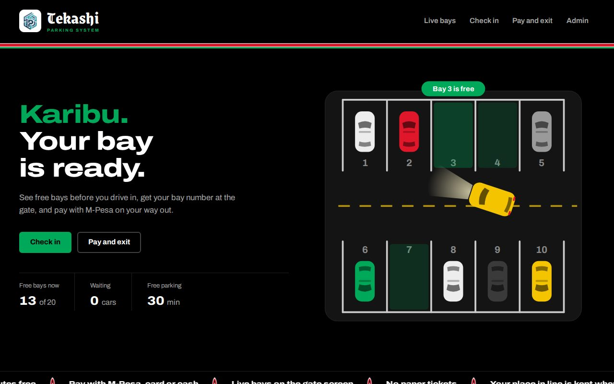
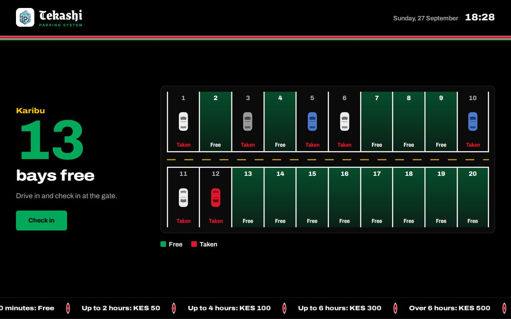
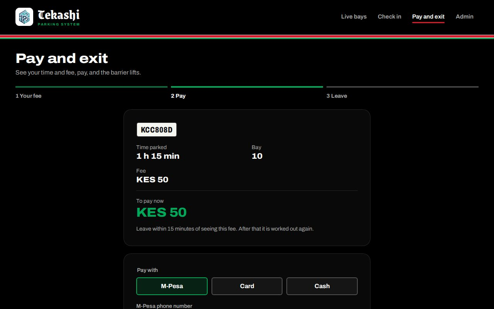
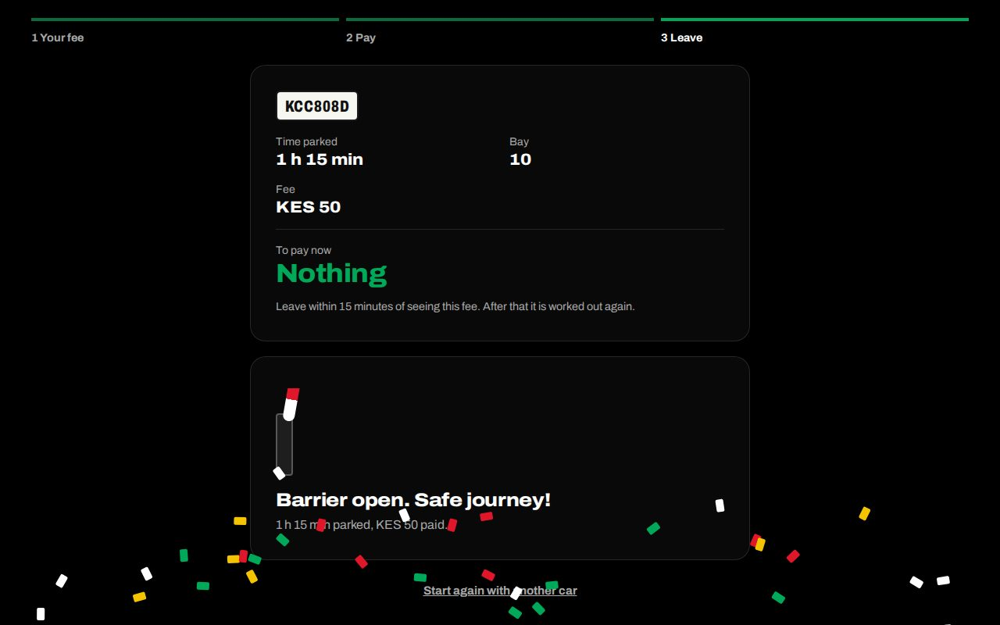
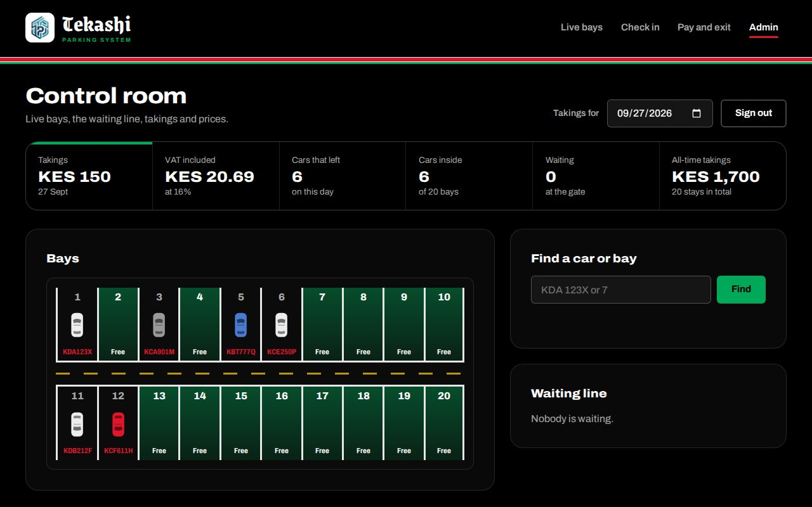

# Tekashi Parking System

A modern, web-based parking system for a car park in Kenya. Drivers see the
free bays **before they drive in**, get a bay number at the gate, and pay by
**M-Pesa**, card or cash when they leave. The barrier opens only after
payment.

Built for **Data Structures and Algorithms, Task One (Phase 2)** at
Multimedia University of Kenya, in **Python** (FastAPI, Jinja2, SQLite).



---

## What the client asked for, and where it is

| Client requirement | How the system does it | Page |
| --- | --- | --- |
| Drivers see the available slots before entry | A live gate screen: free bays glow green, taken bays show a car, refreshes every 3 seconds | `/display` |
| Record vehicles on arrival | Plate typed at the gate; the nearest free bay is assigned; if full, the car joins a first-come, first-served line | `/entry` |
| Calculate time spent and amount to pay on exit | Time is counted to the minute and priced from the rate table | `/exit` |
| Barrier opens only after payment | M-Pesa prompt (Daraja sandbox), card or cash; the barrier lifts only for a paid car | `/exit` |
| Fees: 30 min free, 2 h KES 50, 4 h KES 100, 6 h KES 300, over 6 h KES 500 | Stored as data, so management can change them without touching code | `/admin` |

## Screenshots

| Gate screen | Pay and exit |
| --- | --- |
|  |  |
| **Barrier opens after payment** | **Control room (staff only)** |
|  |  |

---

## Data structures, and why each one

| Structure | Used for | Why it fits | Speed |
| --- | --- | --- | --- |
| **Array** | The bays (index = bay number - 1) | Bays have fixed positions, like a real car park | O(1) look-up |
| **Min-heap** | Free bay numbers | Always gives the lowest-numbered free bay | O(1) peek, O(log n) take / free |
| **Hash table** (`dict`) | Vehicle records by plate | Every quote, payment and exit looks a car up by plate | O(1) average |
| **Queue** (`deque`) | Cars waiting when the lot is full | First come, first served (a stack would let late cars jump the line) | O(1) join / serve |
| **Hash set** | Plates in the queue | "Is this car already waiting?" without scanning the queue | O(1) |
| **Sorted list** | The rate table | Scanned from the shortest tier up; rates are data, not code | O(m) |
| **Append-only list** | The audit log of completed stays | Money history must only grow, never be edited | O(1) append |

Everything in memory is mirrored in an **SQLite** database and rebuilt on
start-up, so a restart or power cut loses nothing. The full design (six
modules, algorithms, pseudocode, database, invariants and complexity) is in
**[docs/design.md](docs/design.md)**.

## The six modules

| Module | File | What it does |
| --- | --- | --- |
| 1. Slot Management | `modules/slots.py` | Heap allocation of bays, the live bay map |
| 2. Vehicle Entry | `modules/entry.py` | Plate checks, check-in, the waiting queue |
| 3. Duration and Fee | `modules/fees.py` | Time parked (rounded up), fee, rate validation |
| 4. Payment | `modules/payment.py` | M-Pesa STK Push, simulated card and cash |
| 5. Barrier Control | `modules/barrier.py` | Opens only for a known, paid car; promotes the next car in line |
| 6. Reporting / Audit | `modules/audit.py` | Takings, VAT, daily report, recent stays |

---

## Run it on your computer (Windows)

You need **Python 3.10 or newer** and **Git**.

```powershell
git clone https://github.com/gitau254-m/tekashi-parking-system.git
cd tekashi-parking-system

python -m venv .venv
.venv\Scripts\Activate.ps1
pip install -r requirements.txt

copy .env.example .env
```

Open `.env` and set at least `ADMIN_PASSWORD`. Then start the server:

```powershell
uvicorn main:app --reload
```

Open **http://127.0.0.1:8000**.

On macOS or Linux, activate the environment with `source .venv/bin/activate`
and copy the file with `cp .env.example .env`.

### Pages

| Page | Who uses it |
| --- | --- |
| `/` | Everyone: live availability, how it works, prices |
| `/display` | The screen at the entrance |
| `/entry` | Check in at the gate |
| `/exit` | See the fee, pay, open the barrier |
| `/admin` | Staff: bays with plates, waiting line, prices, takings (sign in with `ADMIN_PASSWORD`) |
| `/docs` | Automatic API documentation, where every route can be tried |

### M-Pesa (optional)

With `MPESA_ENABLED=false` (the default) M-Pesa is simulated: instant, and
no money moves. To send a **real** sandbox prompt to a phone:

1. Create a free sandbox app at [developer.safaricom.co.ke](https://developer.safaricom.co.ke)
   with the M-Pesa Express product.
2. Put its Consumer Key, Consumer Secret and the sandbox passkey in `.env`,
   and set `MPESA_ENABLED=true`.

A sandbox prompt to a real phone takes **real money** from that M-Pesa
account (Safaricom normally reverses it), so the prompt asks for
`MPESA_SANDBOX_AMOUNT` (KES 1 by default) while the system records the real
fee as paid.

### Run the tests

```powershell
python -m pytest
```

64 tests cover every fee boundary, full check-in-to-exit journeys, the
queue, the grace period, returning cars, M-Pesa (with Safaricom faked), a simulated restart,
and the admin sign-in. After every test, the six rules the data must always
obey (the invariants) are checked.

---

## Project structure

```
main.py        start-up and the JSON API          pages.py     web pages, admin sign-in
auth.py        admin password and sessions        daraja.py    M-Pesa Daraja client
config.py      settings and defaults              clock.py     the one source of time
models.py      data shapes and ParkingError       state.py     in-memory structures, rebuild, invariants
database.py    SQLite schema and helpers          modules/     the six modules
templates/     Jinja2 pages                       static/      CSS, JavaScript, fonts, Motion
tests/         automated tests                    docs/        design document, screenshots
```

## Built with

Python, FastAPI, Jinja2, SQLite, httpx and pytest. Animations use
[Motion](https://motion.dev) (MIT licence). Fonts: Archivo and Grenze Gotisch
(SIL Open Font Licence). All three are stored in `static/`, so the site
works without internet. The car park drawings are original.

---

**Author:** [gitau254-m](https://github.com/gitau254-m), Multimedia University of Kenya
