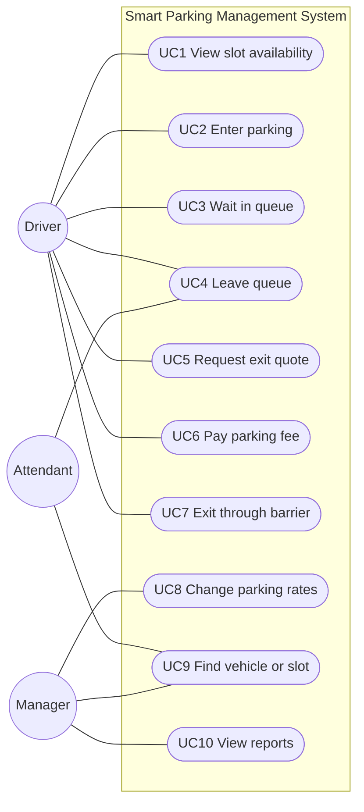
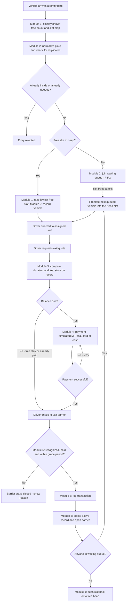
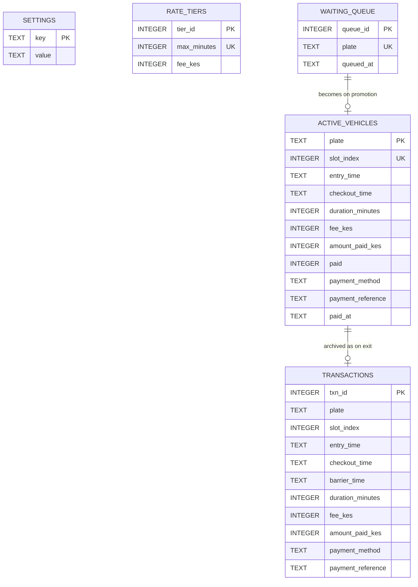

# Smart Parking Management System

### Data Structures & Algorithm Design Document — Task One

**Course:** Data Structures and Algorithms — Multimedia University of Kenya (MMU)
**Language:** Python (FastAPI web application, Jinja2 page templates, SQLite database)

---

## Table of Contents

1. [Introduction](#1-introduction)
2. [Use Cases](#2-use-cases)
3. [Requirements Analysis — Module Identification](#3-requirements-analysis--module-identification)
4. [Module Design](#4-module-design)
5. [Exception Handling](#5-exception-handling)
6. [Complexity Summary](#6-complexity-summary)
7. [System Flow](#7-system-flow)
8. [Dynamic Database Design](#8-dynamic-database-design)
9. [Implementation Plan (Phase 2)](#9-implementation-plan-phase-2)
10. [Future Extensions](#10-future-extensions)

---

## 1. Introduction

### 1.1 Problem Statement

The client requires an automated parking management system for a facility
in Kenya. Drivers must be able to see live slot availability before
entering, vehicles must be recorded on arrival, fees must be calculated
automatically at exit based on duration, and the exit barrier must open
only once payment is confirmed.

### 1.2 Objectives

- Show live slot availability at the entrance and via a web view
- Record each vehicle on arrival — number plate, entry time, allocated slot
- Automatically calculate duration and amount payable at exit
- Accept payment (M-Pesa, card, or cash) and open the barrier only on
  confirmed payment
- Allow management to change parking rates at any time without a software
  change
- Keep a permanent, auditable record of every shilling collected, for
  reconciliation and VAT — one that survives power cuts and server restarts

### 1.3 Scope

**In scope:** entry lane control, slot monitoring and display, slot
allocation, waiting queue when the lot is full, duration and fee
computation, payment collection (simulated), exit barrier control,
exception handling, rate management, and administrative reporting.

**Out of scope for this phase:** online pre-booking of slots, valet
operations, integration with third-party loyalty schemes, automated
number-plate recognition (ANPR) cameras, and number-plate blacklisting.

### 1.4 Assumptions

- **Capacity:** lot capacity is configurable and stored in the database
  (default N = 20 for demonstration). Capacity is only changed when the lot
  is empty.
- **One entry gate, one exit barrier:** each is a single lane. Vehicles
  waiting for a slot wait at the entry gate.
- **Time:** the server clock is the single source of truth. All timestamps
  are full date-and-time values in Kenyan time (EAT, UTC+03:00), never
  clock-time alone.
- **Payment is simulated** in this phase (see Module 4). Live M-Pesa Daraja
  integration is a planned extension, not required for this deliverable.
- **Rates:** the fee structure is the one supplied by the client (below). It
  is stored as data in the database, not hardcoded, so management can edit
  it from the admin page.
- **Money:** all amounts are whole Kenya Shillings stored as integers
  (never floating-point), and published fees are VAT-inclusive.
- **Number plates** are normalized before use: spaces and dashes removed,
  converted to uppercase (`"kda 123x"` → `"KDA123X"`).
- **Grace period:** after paying, a driver has a configurable window
  (default 15 minutes) to reach the exit barrier.

**Client fee structure:**

| Time parked | Fee (KES) |
| --- | --- |
| Up to 30 minutes | 0 (free) |
| Up to 2 hours | 50 |
| Up to 4 hours | 100 |
| Up to 6 hours | 300 |
| Over 6 hours | 500 |

---

## 2. Use Cases

### 2.1 Actors

| Actor | Description |
| --- | --- |
| Driver | Person parking a vehicle. Views availability, enters, pays and exits. |
| Attendant | Staff member operating the gate terminals and handling exceptions (e.g. finding a vehicle, removing a car from the queue). |
| Manager | Management of the facility. Changes rates and views revenue and audit reports. |

### 2.2 Use Case List

| ID | Use Case | Primary Actor | Module(s) |
| --- | --- | --- | --- |
| UC1 | View slot availability before entry | Driver | 1 |
| UC2 | Enter the parking (record vehicle, get a slot) | Driver | 1, 2 |
| UC3 | Wait in queue when the lot is full | Driver | 2 |
| UC4 | Leave the waiting queue | Driver / Attendant | 2 |
| UC5 | Request exit quote (duration and fee) | Driver | 3 |
| UC6 | Pay parking fee | Driver | 4 |
| UC7 | Exit through the barrier | Driver | 5, 6 |
| UC8 | Change parking rates | Manager | 3 |
| UC9 | Find a vehicle / check who is in a slot | Attendant / Manager | 1, 2 |
| UC10 | View revenue and audit reports | Manager | 6 |

### 2.3 Use Case Diagram



---

## 3. Requirements Analysis — Module Identification

Each requirement in the client's terms of reference was mapped to the
module responsible for delivering it, and to the use cases that exercise it:

| # | Client Requirement | Module(s) | Use Case(s) |
| --- | --- | --- | --- |
| 1 | Visual display of available slots before entry | Module 1 — Slot Management | UC1 |
| 2 | Record vehicle on arrival: plate, time, allocated slot | Module 2 — Vehicle Entry | UC2, UC3, UC4 |
| 3 | Auto-calculate duration and amount payable at exit | Module 3 — Duration & Fee Calculation | UC5 |
| 4 | Accept payment; barrier opens only on confirmed payment | Module 4 — Payment, Module 5 — Barrier Control | UC6, UC7 |
| 5 | Rates changeable by management without a software change | Module 3 — rate table stored as data | UC8 |
| 6 | Auditable record of all revenue, for reconciliation / VAT | Module 6 — Reporting / Audit | UC7, UC10 |

**Modules:**

1. Slot Management Module
2. Vehicle Entry Module
3. Duration & Fee Calculation Module
4. Payment Module
5. Barrier Control Module
6. Reporting / Audit Module

---

## 4. Module Design

All six modules share **one parking state** — the in-memory data structures
described below — which is backed by the SQLite database (Section 8).
Every operation that changes the state follows the **write-through rule**:
save the change to the database first, and only then update the in-memory
structures (see Section 8.3). In the pseudocode, lines starting with
`PERSIST:` are the database writes.

---

### 4.1 Module 1: Slot Management Module

**Purpose:** Tracks the real-time status of every physical parking slot,
powers the live availability display at the entrance, and allocates slots
to arriving vehicles.

**Data Structures Used:** Array (`slots`) + Min-Heap (`free_heap`)

**Why an Array for slot status:** Each slot has a fixed physical position
(Slot 1, Slot 2, Slot 3…). An array gives direct access to any slot by its
index in O(1) time — the same way an attendant walks straight to Slot 23
rather than searching for it. The number of slots in a physical lot is
fixed, so a fixed-size array is the natural fit.

**Why a Min-Heap for allocation:** The system always allocates the
**lowest-numbered free slot**, so allocation is predictable and easy for
drivers and attendants to follow. Finding the lowest free slot by scanning
the array (linear search) costs O(n). A min-heap of free slot indices keeps
the smallest free index at its root, so it can be read in O(1) and removed
or added back in O(log n).

For a 20-slot demonstration lot the difference is small, but the heap
scales to a large multi-storey facility (e.g. 2,000 slots) without slowing
down every arrival. The linear search approach is kept below as the
baseline it was compared against.

| Approach | Find a free slot | Free a slot | Comment |
| --- | --- | --- | --- |
| Linear search over the array | O(1) best, O(n) worst | O(1) | Simple, but every arrival may scan the whole lot |
| Min-heap of free indices | O(1) to peek, O(log n) to take | O(log n) | Chosen — fast even for very large lots |

**Representation:**

- `slots` — array of N cells. Index = slot number − 1 (0-based in code).
  Value = `None` if free, or the number plate (string) of the vehicle
  occupying it.
- `free_heap` — min-heap holding the indices of all free slots.
- The number of free slots is simply the size of `free_heap`.

**Privacy rule:** the public entrance display shows only FREE / OCCUPIED
per slot. Number plates are shown only on the attendant/admin pages.

**Algorithms:**

_Pseudocode — setting up and allocating slots:_

```
FUNCTION initialise_slots(N):
    slots = array of N cells, all None
    free_heap = [0, 1, 2, ..., N - 1]   // an ascending list is already a valid min-heap
    RETURN slots, free_heap

FUNCTION peek_free_slot(free_heap):
    IF free_heap is empty:
        RETURN -1
    RETURN free_heap[0]                 // smallest free index is always at the root, O(1)

FUNCTION take_free_slot(free_heap):
    RETURN heap_pop(free_heap)          // removes and returns the smallest index, O(log n)

FUNCTION release_slot(index, slots, free_heap):
    slots[index] = None
    heap_push(free_heap, index)         // O(log n)
```

_Pseudocode — powering the visual display:_

```
FUNCTION count_free_slots(free_heap):
    RETURN length(free_heap)            // O(1)

FUNCTION get_slot_map(slots):
    slot_map = empty list
    FOR index FROM 0 TO length(slots) - 1:
        IF slots[index] == None:
            status = "FREE"
        ELSE:
            status = "OCCUPIED"
        APPEND {slot_number: index + 1, status: status} TO slot_map
    RETURN slot_map                     // O(n) - every slot must be visited to draw the map

FUNCTION who_is_in(slot_number, slots):
    IF slot_number < 1 OR slot_number > length(slots):
        RETURN error "No such slot"
    RETURN slots[slot_number - 1]       // O(1) - admin/attendant use only
```

The entrance display page calls `count_free_slots`, `get_slot_map`, and the
waiting-queue length from Module 2, and refreshes every few seconds so
drivers always see the current state before entering.

_Baseline (compared, not used) — linear search:_

```
FUNCTION find_free_slot_linear(slots):
    FOR index FROM 0 TO length(slots) - 1:
        IF slots[index] == None:
            RETURN index
    RETURN -1
```

**Complexity:** peek O(1); take and release O(log n); free count O(1);
slot map O(n); who-is-in O(1).

---

### 4.2 Module 2: Vehicle Entry Module

**Purpose:** Records each arriving vehicle — number plate, entry time and
allocated slot — or, if the lot is full, places it in a fair waiting line
until a slot opens.

**Data Structures Used:** Hash Table (`vehicle_records`) + Queue
(`waiting_queue`) + Hash Set (`queued_set`)

**Why a Hash Table:** Vehicle records are looked up by number plate
constantly — at every quote, payment and exit. A hash table gives O(1)
average lookup, insert and delete by plate, instead of scanning every
record (which would slow down as more cars park).

**Why a Queue:** When no slot is free, fairness matters — the first car to
arrive must be the first car given a slot once one frees up. A Stack (LIFO)
was considered and rejected: it would let newly arrived cars "jump the
line" ahead of cars already waiting, causing starvation. A Queue (FIFO)
guarantees first-come, first-served.

**Why a Hash Set alongside the Queue:** Before queuing a car we must check
it is not already waiting. Searching a queue for a plate is O(q). Keeping
the same plates in a hash set makes that check O(1). The queue remembers
the **order**; the set answers **"is this plate waiting?"** quickly.

**Representation:**

- `vehicle_records` — hash table. Key = normalized plate. Value = vehicle
  record (fields below).
- `waiting_queue` — FIFO queue of `{plate, queued_at}` entries, in arrival
  order.
- `queued_set` — hash set of the plates currently in `waiting_queue`.

**The vehicle record** (one per vehicle currently inside):

| Field | Filled in by | Meaning |
| --- | --- | --- |
| `slot` | Module 2 | Index of the allocated slot |
| `entry_time` | Module 2 | Date and time the vehicle was given its slot |
| `checkout_time` | Module 3 | Date and time the exit quote was calculated |
| `duration_minutes` | Module 3 | Minutes parked, as charged |
| `fee` | Module 3 | Total fee for that duration (KES) |
| `amount_paid` | Module 4 | Total paid so far (KES), starts at 0 |
| `paid` | Modules 3, 4, 5 | True when nothing is owed for the current quote |
| `payment_method` | Modules 3, 4 | `MPESA`, `CARD`, `CASH`, or `FREE` |
| `payment_reference` | Module 4 | Receipt / transaction reference |
| `paid_at` | Modules 3, 4 | Date and time payment was confirmed |

**Algorithms:**

_Pseudocode:_

```
FUNCTION normalize_plate(raw_plate):
    plate = raw_plate with all spaces and dashes removed, converted to uppercase
    RETURN plate

FUNCTION is_valid_plate(plate):
    RETURN plate has 1 to 10 characters AND contains only letters and digits

FUNCTION new_record(slot_index, time):
    RETURN {slot: slot_index, entry_time: time,
            checkout_time: null, duration_minutes: null, fee: null,
            amount_paid: 0, paid: False,
            payment_method: null, payment_reference: null, paid_at: null}

FUNCTION handle_arrival(raw_plate, state):
    IF capacity == 0:
        RETURN error "No parking capacity configured"

    plate = normalize_plate(raw_plate)
    IF NOT is_valid_plate(plate):
        RETURN error "Invalid number plate"
    IF plate IN vehicle_records:
        RETURN error "Rejected - vehicle is already parked inside"
    IF plate IN queued_set:
        RETURN error "Rejected - vehicle is already in the waiting queue"

    index = peek_free_slot(free_heap)               // Module 1
    IF index != -1:
        record = new_record(index, now())
        PERSIST: INSERT (plate, record) INTO active_vehicles
        take_free_slot(free_heap)                   // Module 1
        slots[index] = plate
        vehicle_records[plate] = record
        RETURN "Welcome - proceed to Slot " + (index + 1)
    ELSE:
        entry = {plate: plate, queued_at: now()}
        PERSIST: INSERT entry INTO waiting_queue
        enqueue(waiting_queue, entry)
        ADD plate TO queued_set
        RETURN "Lot full - you are number " + length(waiting_queue) + " in the queue"

FUNCTION leave_queue(raw_plate, state):
    plate = normalize_plate(raw_plate)
    IF plate NOT IN queued_set:
        RETURN error "Vehicle is not in the waiting queue"
    PERSIST: DELETE plate FROM waiting_queue
    REMOVE the entry with this plate FROM waiting_queue     // O(q) - removing from the middle
    REMOVE plate FROM queued_set
    RETURN "Removed from queue - no charge"
```

**Module interaction:** when a vehicle exits and frees a slot (Module 5),
the system checks the waiting queue first. If it is not empty, the vehicle
at the front is dequeued and given the freed slot directly. The slot only
returns to `free_heap` when nobody is waiting. A promoted vehicle's
`entry_time` is the moment it is given the slot — time spent waiting at the
gate is not charged.

**Complexity:** duplicate checks O(1) average; arrival O(log n) (heap pop)
plus O(1) average hash insert; join queue O(1); leave queue O(q).

---

### 4.3 Module 3: Duration & Fee Calculation Module

**Purpose:** Calculates how long a vehicle was parked and the amount
payable, using a rate table that management can edit.

**Data Structure Used:** Sorted list of tier records (the rate table)

**Why:** Storing the rates as data instead of hardcoded `if/else` logic
means management can change parking rates "without a software change" —
they edit the rate table from the admin page, and the new rates are used
immediately. The list is kept **sorted by `max_minutes` in ascending
order**, with the open-ended tier last. This ordering is a precondition:
the linear scan below returns the first tier that covers the duration, so
it only gives the right answer if the tiers are in ascending order.

**Representation:**

```
[
  {"max_minutes": 30,   "fee": 0},
  {"max_minutes": 120,  "fee": 50},
  {"max_minutes": 240,  "fee": 100},
  {"max_minutes": 360,  "fee": 300},
  {"max_minutes": null, "fee": 500}
]
```

`null` means "no upper limit" — the final tier catches every longer stay.

**Rounding rule:** duration is rounded **up** to the next whole minute.
"Up to 30 minutes free" means 30 minutes exactly is free, but 30 minutes
and 1 second is 31 minutes and costs KES 50.

**Boundary cases (these become the test cases in Phase 2):**

| Duration (minutes) | Fee (KES) |
| --- | --- |
| 0 | 0 |
| 30 | 0 |
| 31 | 50 |
| 120 | 50 |
| 121 | 100 |
| 240 | 100 |
| 241 | 300 |
| 360 | 300 |
| 361 | 500 |
| 1,500 (overnight) | 500 |

**Edge case — overnight stays:** entry and exit are recorded as full
date-and-time values, not clock time alone. A vehicle entering at 23:00 and
leaving at 01:00 the next day has a real duration of 2 hours. Comparing
clock hours only (01:00 − 23:00) would give a negative, meaningless result.

**Why not Binary Search?** Binary search would find the tier in O(log m)
instead of O(m), because the list is sorted. With only 5 tiers the
difference is negligible, so the simpler linear scan was chosen. If the
client ever introduced many fine-grained tiers, binary search would be the
upgrade.

**Algorithms:**

_Pseudocode — duration and fee:_

```
FUNCTION calculate_duration(entry_time, exit_time):
    seconds = total_seconds(exit_time - entry_time)
    IF seconds < 0:
        RAISE error "Clock error - exit time is before entry time"
    RETURN CEILING(seconds / 60)             // round UP to whole minutes

FUNCTION calculate_fee(duration_minutes, rate_table):
    // precondition: rate_table is sorted ascending, open-ended tier last
    FOR each tier IN rate_table:
        IF tier.max_minutes IS null OR duration_minutes <= tier.max_minutes:
            RETURN tier.fee
```

_Pseudocode — the exit quote (UC5):_

The quote fixes the checkout time, duration and fee **on the vehicle
record**. Payment and the audit log both use these stored values, so the
duration recorded in the audit log always matches the fee that was charged.

```
FUNCTION request_exit_quote(raw_plate, state):
    plate = normalize_plate(raw_plate)
    IF plate NOT IN vehicle_records:
        RETURN error "Unrecognized vehicle"

    record = vehicle_records[plate]
    checkout_time = now()
    minutes = calculate_duration(record.entry_time, checkout_time)
    fee = calculate_fee(minutes, rate_table)
    balance = fee - record.amount_paid      // re-quotes only charge the difference

    updated = copy of record
    updated.checkout_time = checkout_time
    updated.duration_minutes = minutes
    updated.fee = fee
    updated.paid = (balance <= 0)
    IF balance <= 0 AND record.amount_paid == 0:
        updated.payment_method = "FREE"     // stayed 30 minutes or less
        updated.paid_at = checkout_time

    PERSIST: UPDATE active_vehicles SET fields of updated WHERE plate = plate
    vehicle_records[plate] = updated
    RETURN {duration_minutes: minutes, fee: fee, balance_due: MAX(balance, 0)}
```

_Pseudocode — loading and changing rates (UC8):_

```
FUNCTION load_rate_table(rows):
    bounded    = rows whose max_minutes is not null, SORTED ascending by max_minutes
    open_ended = rows whose max_minutes is null
    IF length(open_ended) != 1:
        RAISE error "There must be exactly one open-ended final tier"
    IF any two tiers in bounded have the same max_minutes:
        RAISE error "Duplicate tier"
    IF any max_minutes <= 0 OR any fee < 0:
        RAISE error "Invalid tier values"
    table = bounded followed by open_ended
    IF any tier's fee is lower than the fee of the tier before it:
        RAISE error "Fees must not decrease as parking time increases"
    RETURN table

FUNCTION update_rates(new_rows, state):
    new_table = load_rate_table(new_rows)   // validate FIRST - a bad table is refused
    PERSIST: in one database transaction, DELETE all rate_tiers, INSERT new_rows
    rate_table = new_table                  // new quotes use the new rates immediately
```

If validation fails, the manager's change is refused and the old rates stay
in force — the system is never left without a usable rate table.

**Complexity:** duration O(1); fee lookup O(m), where m = number of tiers
(5); loading/validating rates O(m log m) because of the sort; quote O(m).

---

### 4.4 Module 4: Payment Module

**Purpose:** Collects the parking fee for an exiting vehicle and records
that it has been paid, so the barrier is permitted to open.

**Data Structure Used:** Hash Table — extends the same vehicle record from
Module 2 with the payment fields.

**Why:** Payment status belongs to a specific vehicle that is already being
tracked. Rather than creating a separate structure, the existing O(1)
lookup record is updated with `amount_paid`, `paid`, `payment_method`,
`payment_reference` and `paid_at`.

**Note on scope:** payment is **simulated** in this build (representing
M-Pesa, card, or cash) instead of integrating a live payment gateway, to
keep the focus on the data structures and modules. `simulate_gateway`
returns success with a generated reference (e.g. `SIM-7F3K2Q`), or a
failure when the demo operator chooses "simulate failure" — so the failure
path can be demonstrated. The `payment_method` and `payment_reference`
fields are designed so that real M-Pesa Daraja integration can replace
`simulate_gateway` later without redesigning anything else.

**Algorithm:**

1. A quote must exist (Module 3) — otherwise there is nothing to pay
2. If nothing is owed, report that — a vehicle is never charged twice
3. Send the outstanding balance to the (simulated) gateway
4. On failure: change nothing; `paid` stays False, the driver retries
5. On success: update the record and save it

_Pseudocode:_

```
FUNCTION confirm_payment(raw_plate, method, state):
    plate = normalize_plate(raw_plate)
    IF plate NOT IN vehicle_records:
        RETURN error "Unrecognized vehicle"
    record = vehicle_records[plate]
    IF record.fee IS null:
        RETURN error "Request an exit quote first"
    IF record.paid == True:
        RETURN "Nothing to pay - already settled"
    IF method NOT IN {"MPESA", "CARD", "CASH"}:
        RETURN error "Unsupported payment method"

    balance = record.fee - record.amount_paid
    result = simulate_gateway(method, balance)
    IF result.success == False:
        RETURN error "Payment failed: " + result.reason + " - barrier stays closed, please retry"

    updated = copy of record
    updated.amount_paid = record.amount_paid + balance
    updated.paid = True
    updated.payment_method = method
    updated.payment_reference = result.reference
    updated.paid_at = now()

    PERSIST: UPDATE active_vehicles SET fields of updated WHERE plate = plate
    vehicle_records[plate] = updated
    RETURN receipt {plate, amount: balance, method, reference: result.reference}
```

**Complexity:** O(1) average — direct hash table access by plate.

---

### 4.5 Module 5: Barrier Control Module

**Purpose:** Controls the exit — verifies the vehicle is known, paid, and
still within its grace period before opening the barrier; then logs the
transaction, frees the slot, and gives it to the next waiting vehicle, if
any.

**Data Structures Used:** None new — this module coordinates the Array and
Min-Heap (Module 1), the Hash Table, Queue and Hash Set (Module 2), and the
Audit List (Module 6).

**Why no new structure:** this module's role is orchestration, not storage.
It reads and updates structures already justified in the earlier modules.

**Why a grace period:** the fee is fixed at the moment of the quote. Without
a time limit, a driver could take a free quote at minute 29, "pay" KES 0,
and stay for five more hours. So the barrier only honours a payment for
`GRACE_MINUTES` (default 15) after the quote. After that, the driver must
request a new quote — and pays only the difference (Module 3).

**Algorithm (guard clauses first, then the exit):**

1. Guard: plate not found → barrier stays closed
2. Guard: not paid → barrier stays closed
3. Guard: grace period expired → mark unpaid, ask for a new quote
4. Save everything to the database in **one transaction**: write the audit
   record, delete the active vehicle, and promote the next queued vehicle
   (if any). If any part fails, all of it is undone and the barrier stays
   closed.
5. Mirror the same changes in memory: append to the audit list, delete the
   hash table record, then either give the slot to the next queued vehicle
   or push it back onto the free-slot heap
6. Open the barrier

Note the order: the transaction is **logged before** the active record is
deleted, because the log is built from that record.

_Pseudocode:_

```
FUNCTION process_exit(raw_plate, state):
    plate = normalize_plate(raw_plate)
    IF plate NOT IN vehicle_records:
        RETURN "Unrecognized vehicle - barrier remains closed"

    record = vehicle_records[plate]
    IF record.paid == False:
        RETURN "Payment required - barrier remains closed"

    IF minutes_between(record.checkout_time, now()) > GRACE_MINUTES:
        updated = copy of record with paid = False
        PERSIST: UPDATE active_vehicles SET paid = False WHERE plate = plate
        vehicle_records[plate] = updated
        RETURN "Exit window expired - please request a new quote"

    barrier_time = now()
    transaction = build_transaction(plate, record, barrier_time)    // Module 6
    freed_index = record.slot
    IF waiting_queue is not empty:
        next_entry = front of waiting_queue       // look, don't remove yet
        next_record = new_record(freed_index, barrier_time)
    ELSE:
        next_entry = null

    // Step A - persist first, all-or-nothing
    BEGIN DATABASE TRANSACTION
        INSERT transaction INTO transactions
        DELETE plate FROM active_vehicles
        IF next_entry != null:
            DELETE next_entry.plate FROM waiting_queue
            INSERT (next_entry.plate, next_record) INTO active_vehicles
    COMMIT      // on any failure: ROLLBACK, return "System error - barrier remains closed"

    // Step B - mirror in memory
    APPEND transaction TO audit_log                 // Module 6
    DELETE vehicle_records[plate]
    IF next_entry != null:
        dequeue(waiting_queue)
        REMOVE next_entry.plate FROM queued_set
        slots[freed_index] = next_entry.plate
        vehicle_records[next_entry.plate] = next_record
        show on entry display: next_entry.plate + " - proceed to Slot " + (freed_index + 1)
    ELSE:
        release_slot(freed_index, slots, free_heap) // Module 1 - back onto the heap

    open_barrier()
    RETURN "Exit successful - barrier opened"
```

**Complexity:** O(log n) worst case (the heap push when nobody is waiting);
O(1) average otherwise — hash lookups and deletes, queue dequeue, array
update and list append.

---

### 4.6 Module 6: Reporting / Audit Module

**Purpose:** Keeps a permanent, chronological record of every completed
parking transaction, for reconciliation and VAT reporting.

**Data Structure Used:** List (append-only log), mirrored in the
`transactions` database table

**Why:** Unlike Module 1's array (overwritten as slots change), this module
must never edit or delete history — only add to it — to protect the
integrity of financial records. A list that only grows, in chronological
order, matches this exactly. In the database, the application has **no
code path that updates or deletes a transaction row**; there is only
`INSERT`.

**Representation:** `audit_log` — a list of transaction records, each
holding plate, slot, entry time, checkout time, barrier time, duration,
fee, amount paid, payment method and payment reference.

Because the duration and fee come from the stored quote (Module 3), every
logged transaction is internally consistent: its duration always falls in
the tier that produced its fee.

**Algorithms:**

1. When Module 5 processes an exit, a transaction record is built from the
   vehicle's record and appended to the log (database first, then memory)
2. Reports traverse the log. A total cannot be shortcut — every entry must
   be visited once

_Pseudocode:_

```
FUNCTION build_transaction(plate, record, barrier_time):
    RETURN {plate: plate, slot: record.slot,
            entry_time: record.entry_time,
            checkout_time: record.checkout_time,
            barrier_time: barrier_time,
            duration_minutes: record.duration_minutes,
            fee: record.fee,
            amount_paid: record.amount_paid,
            payment_method: record.payment_method,
            payment_reference: record.payment_reference}

FUNCTION total_collected(audit_log):
    total = 0
    FOR each transaction IN audit_log:
        total = total + transaction.amount_paid
    RETURN total

FUNCTION daily_report(audit_log, date):
    count = 0
    total = 0
    FOR each transaction IN audit_log:
        IF date_of(transaction.barrier_time) == date:
            count = count + 1
            total = total + transaction.amount_paid
    RETURN {date: date, vehicles: count, revenue: total}

FUNCTION vat_portion(total, vat_rate_percent):
    // fees are VAT-inclusive, so the VAT inside a total is rate / (100 + rate)
    RETURN total * vat_rate_percent / (100 + vat_rate_percent)
```

**Note:** traversing the in-memory list demonstrates the algorithm. In
production, the same report would be a SQL `SUM` query using the index on
`barrier_time` (Section 8.4), which avoids reading every row for a
single-day report.

**Complexity:** append O(1) amortized; total and daily report O(t), where
t = number of transactions ever recorded — unavoidable, since every
shilling must be accounted for.

---

## 5. Exception Handling

Foreseeable failure cases are part of each module's algorithm design, not
an afterthought:

| # | Module | Exception Case | Handling |
| --- | --- | --- | --- |
| 1 | 1 — Slot Management | Capacity configured as 0 | Entry and display report "No parking capacity configured" instead of failing on an empty array |
| 2 | 1 — Slot Management | Lookup of a slot number that does not exist (e.g. 0 or 25 in a 20-slot lot) | Bounds checked before indexing; "No such slot" returned |
| 3 | 2 — Vehicle Entry | Empty or invalid plate | Rejected before any data structure is touched |
| 4 | 2 — Vehicle Entry | Same plate typed differently (`kda 123x` vs `KDA123X`) | `normalize_plate` makes them identical, so all lookups and duplicate checks work |
| 5 | 2 — Vehicle Entry | Plate already parked inside | Entry rejected — one plate cannot hold two slots |
| 6 | 2 — Vehicle Entry | Plate already in the waiting queue | Rejected — O(1) check against `queued_set` |
| 7 | 2 — Vehicle Entry | Vehicle leaves the queue before being given a slot | `leave_queue` removes it; no billing record ever existed, so nothing is charged |
| 8 | 3 — Duration & Fee | Stay crosses midnight (entry 23:00, exit 01:00 next day) | Full date-and-time values are stored, so the duration is correct, never negative |
| 9 | 3 — Duration & Fee | Exit time earlier than entry time (clock fault) | `calculate_duration` raises an error; no fee is computed; attendant is alerted |
| 10 | 3 — Duration & Fee | Manager submits an invalid rate table (unsorted, duplicate tiers, no final tier, negative fee) | `load_rate_table` sorts and validates; invalid tables are refused and the old rates stay in force |
| 11 | 3, 4 — Quote / Payment | Quote or payment requested for an unknown plate | "Unrecognized vehicle" returned |
| 12 | 4 — Payment | Payment attempted before a quote | "Request an exit quote first" |
| 13 | 4 — Payment | Payment fails (declined, cancelled, timed out) | Record unchanged; `paid` stays False; driver retries |
| 14 | 4 — Payment | Driver tries to pay twice | "Already settled" — never charged twice |
| 15 | 5 — Barrier Control | Exit requested for an unknown plate | Barrier stays closed, "Unrecognized vehicle" |
| 16 | 5 — Barrier Control | Exit requested before payment | Guard clause rejects it — the direct implementation of "barrier opens only on confirmed payment" |
| 17 | 5 — Barrier Control | Driver paid but reached the barrier after the grace period | `paid` reset; driver requests a new quote and pays only the difference |
| 18 | 5, 6 — Exit / Audit | Database write fails during an exit | Whole transaction rolled back; memory untouched; barrier stays closed; safe to retry |
| 19 | All | Server restarts or power cut | `rebuild_from_database` restores all structures on start-up (Section 8.6) |
| 20 | All | Two requests arrive at the same moment | All state-changing operations run one at a time behind a single lock, so two cars can never be given the same slot |

---

## 6. Complexity Summary

n = number of slots, v = vehicles currently inside, q = vehicles waiting,
m = rate tiers, t = transactions recorded.

| Module | Operation | Typical | Worst |
| --- | --- | --- | --- |
| 1 — Slot Management | Initialise slots and heap | O(n) | O(n) |
| 1 — Slot Management | Peek lowest free slot | O(1) | O(1) |
| 1 — Slot Management | Take free slot (heap pop) | O(log n) | O(log n) |
| 1 — Slot Management | Release slot (heap push) | O(log n) | O(log n) |
| 1 — Slot Management | Count free slots | O(1) | O(1) |
| 1 — Slot Management | Build slot map for display | O(n) | O(n) |
| 1 — Slot Management | Who is in slot X | O(1) | O(1) |
| 1 — Slot Management | Baseline linear search (not used) | O(1) best | O(n) |
| 2 — Vehicle Entry | Duplicate checks (hash table / set) | O(1) | O(v) or O(q) * |
| 2 — Vehicle Entry | Record arrival | O(log n) | O(log n + v) * |
| 2 — Vehicle Entry | Join waiting queue | O(1) | O(1) |
| 2 — Vehicle Entry | Leave waiting queue | O(q) | O(q) |
| 3 — Duration & Fee | Calculate duration | O(1) | O(1) |
| 3 — Duration & Fee | Rate tier lookup | O(1) best | O(m) |
| 3 — Duration & Fee | Load / validate rate table | O(m log m) | O(m log m) |
| 4 — Payment | Confirm payment | O(1) | O(v) * |
| 5 — Barrier Control | Process exit | O(1) | O(log n) |
| 6 — Reporting | Log transaction (append) | O(1) amortized | O(t) ** |
| 6 — Reporting | Total revenue / daily report | O(t) | O(t) |
| Database | Rebuild on start-up | O(n + v + q + t + m log m) | same |

\* A hash table is O(1) on **average**. In the worst case — many keys
colliding at the same position — a lookup degrades to O(v). Python's
`dict` uses open addressing (the same family of collision resolution as
linear probing in the course notes, with a smarter probe sequence), so
this worst case is very rare in practice.

\*\* Python lists grow by occasionally copying into a larger block; that
copy is O(t), but it happens so rarely that the average cost per append
stays O(1) ("amortized").

---

## 7. System Flow



---

## 8. Dynamic Database Design

### 8.1 What makes this database "dynamic"

The database is **dynamic** because its shape changes at runtime, not just
its values: records are inserted and removed continuously as vehicles
arrive and leave, the waiting queue grows and shrinks with congestion, the
free-slot heap reorganizes itself on every allocation and release, the
transaction log grows indefinitely, and management can replace the rate
table while the system is running.

### 8.2 Two-layer design

| Layer | What it is | Role |
| --- | --- | --- |
| Working layer | In-memory data structures (array, min-heap, hash table, queue, hash set, lists) | Fast operations using the algorithms in Section 4 |
| Persistent layer | SQLite database file (`parking.db`) | Permanent storage; survives restarts and power cuts; source of truth for recovery |

Memory alone is not enough: if the server restarts, every parked vehicle
and the entire audit log would be lost — which would break the "permanent,
auditable record" requirement. The database alone would work, but would
hide the data structures this design is built around. Using both gives
fast in-memory algorithms **and** permanent records.

| In-memory structure | Database table | Module |
| --- | --- | --- |
| `slots` (Array) + `free_heap` (Min-Heap) | Derived from `active_vehicles` and `settings.capacity` — not stored separately | 1 |
| `vehicle_records` (Hash Table) | `active_vehicles` | 2, 3, 4 |
| `waiting_queue` (Queue) + `queued_set` (Hash Set) | `waiting_queue` | 2 |
| `rate_table` (Sorted List) | `rate_tiers` | 3 |
| `audit_log` (Append-only List) | `transactions` | 6 |
| Configuration values | `settings` | All |

Slot status is **not** stored as its own table: it can always be worked
out from `active_vehicles` (each row holds a unique slot index). Storing it
twice would risk the two copies disagreeing.

### 8.3 The write-through rule

Every operation that changes state follows the same order:

1. **Persist first** — write the change to SQLite. Multi-step changes (like
   an exit) run inside one database transaction, so either every step is
   saved or none is.
2. **Then mirror in memory** — apply the same change to the in-memory
   structures.

If step 1 fails, memory is never touched, so memory and database cannot
drift apart. In addition, all state-changing operations run **one at a
time** behind a single lock, so two simultaneous arrivals can never both
receive the same slot.

### 8.4 Schema (SQLite)

SQLite has no dedicated date type, so timestamps are stored as ISO 8601
text with the time zone (e.g. `2026-09-24T14:05:00+03:00`). Money is stored
as `INTEGER` whole shillings. Booleans are stored as `0` / `1`.

```sql
-- Configuration values (capacity, grace period, VAT rate)
CREATE TABLE settings (
    key   TEXT PRIMARY KEY,
    value TEXT NOT NULL
);
-- initial rows: ('capacity', '20'), ('grace_minutes', '15'), ('vat_rate_percent', '16')

-- Parking rates, editable by management
CREATE TABLE rate_tiers (
    tier_id     INTEGER PRIMARY KEY AUTOINCREMENT,
    max_minutes INTEGER UNIQUE,                    -- NULL = open-ended final tier
    fee_kes     INTEGER NOT NULL CHECK (fee_kes >= 0)
);

-- Vehicles currently inside the lot
CREATE TABLE active_vehicles (
    plate             TEXT PRIMARY KEY,
    slot_index        INTEGER NOT NULL UNIQUE CHECK (slot_index >= 0),
    entry_time        TEXT NOT NULL,
    checkout_time     TEXT,
    duration_minutes  INTEGER,
    fee_kes           INTEGER,
    amount_paid_kes   INTEGER NOT NULL DEFAULT 0,
    paid              INTEGER NOT NULL DEFAULT 0 CHECK (paid IN (0, 1)),
    payment_method    TEXT,
    payment_reference TEXT,
    paid_at           TEXT
);

-- Vehicles waiting at the gate while the lot is full
CREATE TABLE waiting_queue (
    queue_id  INTEGER PRIMARY KEY AUTOINCREMENT,   -- increasing id preserves arrival order
    plate     TEXT NOT NULL UNIQUE,
    queued_at TEXT NOT NULL
);

-- Append-only audit log of completed stays
CREATE TABLE transactions (
    txn_id            INTEGER PRIMARY KEY AUTOINCREMENT,
    plate             TEXT NOT NULL,
    slot_index        INTEGER NOT NULL,
    entry_time        TEXT NOT NULL,
    checkout_time     TEXT NOT NULL,
    barrier_time      TEXT NOT NULL,
    duration_minutes  INTEGER NOT NULL,
    fee_kes           INTEGER NOT NULL,
    amount_paid_kes   INTEGER NOT NULL,
    payment_method    TEXT NOT NULL,
    payment_reference TEXT
);

-- Index so daily / date-range reports do not scan the whole table
CREATE INDEX idx_transactions_barrier_time ON transactions (barrier_time);
```

`transactions.plate` is deliberately **not** a foreign key: the matching
`active_vehicles` row is deleted when the vehicle leaves, but its history
must remain.

### 8.5 Entity Relationship Diagram



The two relationships describe how a record **moves** between tables over a
vehicle's lifetime (queue → active → transaction). They are not foreign
keys, because the earlier row is deleted when the record moves on.
`SETTINGS` and `RATE_TIERS` are reference tables read by the modules.

### 8.6 Start-up: rebuilding memory from the database

On every start-up, the in-memory structures are rebuilt from SQLite, so a
restart loses nothing:

```
FUNCTION rebuild_from_database(db):
    N = db.settings["capacity"]
    slots = array of N cells, all None
    vehicle_records = empty hash table
    FOR each row IN db.active_vehicles:
        vehicle_records[row.plate] = row
        slots[row.slot_index] = row.plate

    free_heap = empty list
    FOR index FROM 0 TO N - 1:
        IF slots[index] == None:
            APPEND index TO free_heap       // added in ascending order - already a valid min-heap

    waiting_queue = empty queue
    queued_set = empty set
    FOR each row IN db.waiting_queue ORDERED BY queue_id:
        enqueue(waiting_queue, row)
        ADD row.plate TO queued_set

    rate_table = load_rate_table(db.rate_tiers)
    audit_log = all rows of db.transactions ORDERED BY txn_id

    check_invariants(state)                 // Section 8.7
    RETURN state
```

**Complexity:** O(n + v + q + t + m log m) — each row is read once.

### 8.7 Invariants

These statements must be true after every operation. The implementation
will include a `check_invariants()` function that verifies them after
start-up and during testing:

1. `slots[i] == p` exactly when `vehicle_records[p].slot == i` — the array
   and the hash table always agree.
2. Index `i` is in `free_heap` exactly when `slots[i]` is `None`.
3. `size(free_heap) + size(vehicle_records) == N` — every slot is either
   free or occupied, never both, never neither.
4. If `free_heap` is not empty, `waiting_queue` is empty — nobody waits
   while a slot is free.
5. `queued_set` holds exactly the plates in `waiting_queue`, and no plate is
   both parked and queued.

### 8.8 Query capability: two-way lookup

Combining the Array and the Hash Table gives O(1) lookup in both
directions, without any extra structure:

- **Slot → Occupant:** `slots[slot_number - 1]` — who is in a given slot
- **Occupant → Slot:** `vehicle_records[plate].slot` — where a given car is

An attendant or manager can answer "who is in Slot 5?" or "where is
KDA123X?" instantly, without scanning every record.

### 8.9 Full data lifecycle (one vehicle, start to finish)

1. **Arrival** — plate normalized and checked for duplicates. If a slot is
   free: a record is saved to `active_vehicles`, the lowest free index is
   popped from `free_heap`, the array and hash table are updated. If the
   lot is full: the vehicle is saved to `waiting_queue` and added to the
   queue and set.
2. **Exit quote** — Module 3 reads `entry_time` from the hash table,
   calculates duration and fee against the rate table, and stores
   checkout time, duration and fee on the record (database first, then
   memory). Stays of 30 minutes or less are marked paid automatically.
3. **Payment** — Module 4 sends the balance to the simulated gateway. On
   success, the record's payment fields are updated (database first, then
   memory).
4. **Barrier** — Module 5 checks the vehicle is known, paid, and within
   the grace period. In one database transaction it inserts the audit row,
   deletes the active row, and promotes the next queued vehicle if there is
   one.
5. **Memory mirror** — the transaction is appended to `audit_log`, the
   record is removed from the hash table, and the freed slot either goes
   straight to the promoted vehicle or back onto `free_heap`. The barrier
   opens.
6. **History** — the transaction stays in `transactions` and `audit_log`
   permanently, available to Module 6 reports.

---

## 9. Implementation Plan (Phase 2)

### 9.1 From design to Python

| Design concept | Python tool |
| --- | --- |
| Array (fixed size) | `list` created once as `[None] * N`, never appended to |
| Min-Heap | `heapq` module (`heappush`, `heappop`) on a `list` |
| Queue (FIFO) | `collections.deque` (`append`, `popleft`) |
| Hash Table | `dict` |
| Hash Set | `set` |
| Rounding up minutes | `math.ceil` |
| Timestamps with time zone | `datetime` with `zoneinfo.ZoneInfo("Africa/Nairobi")` |
| Database | `sqlite3` (built into Python) |
| One operation at a time | `threading.Lock` |
| Web server | FastAPI |
| Web pages | Jinja2 templates |

### 9.2 Planned project structure

```
parking_system/
├── main.py            # FastAPI app and page routes
├── config.py          # constants and default settings
├── database.py        # SQLite connection, schema, rebuild_from_database
├── state.py           # the shared in-memory structures + lock + check_invariants
├── modules/
│   ├── slots.py       # Module 1 - Slot Management
│   ├── entry.py       # Module 2 - Vehicle Entry
│   ├── fees.py        # Module 3 - Duration & Fee Calculation
│   ├── payment.py     # Module 4 - Payment
│   ├── barrier.py     # Module 5 - Barrier Control
│   └── audit.py       # Module 6 - Reporting / Audit
├── templates/         # Jinja2 HTML pages
├── static/            # CSS
├── tests/             # boundary and exception tests
└── README.md
```

### 9.3 Pages

| Page | Users | Use cases |
| --- | --- | --- |
| `/display` — entrance availability screen (auto-refresh) | Driver | UC1 |
| `/entry` — entry gate terminal | Driver / Attendant | UC2, UC3, UC4 |
| `/exit` — quote, payment and barrier | Driver | UC5, UC6, UC7 |
| `/admin` — vehicle lookup, rates, reports | Attendant / Manager | UC8, UC9, UC10 |

---

## 10. Future Extensions

- Live M-Pesa Daraja (STK Push) integration, replacing `simulate_gateway`
- Separate `payments` table, so a stay paid in several parts (e.g. a
  top-up after the grace period) keeps every payment's method and reference
- Automatic number-plate recognition (ANPR) cameras at entry and exit
- Multiple entry and exit lanes
- Online pre-booking of slots
- Number-plate blacklisting and refund handling