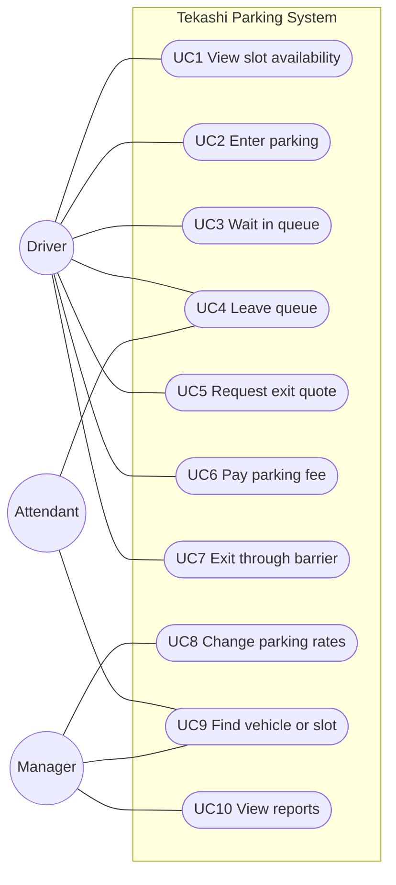
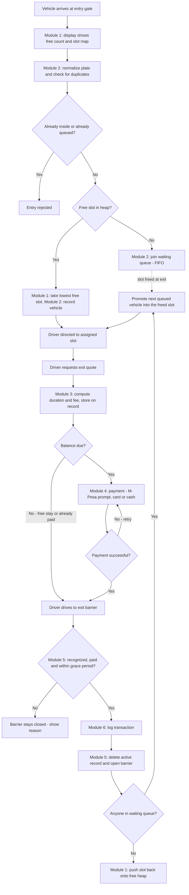
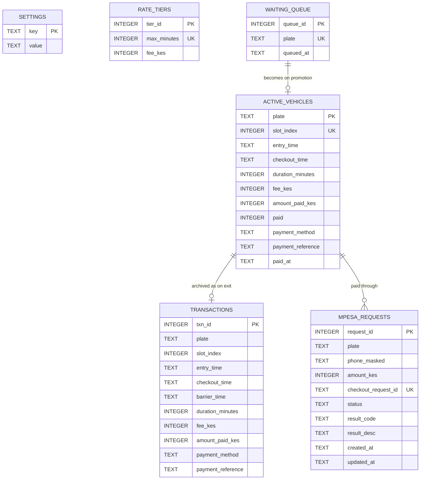

# Tekashi Parking System

### Data Structures & Algorithm Design Document — Task One

**Course:** Data Structures and Algorithms — Multimedia University of Kenya (MMU)
**Language:** Python (FastAPI web application, Jinja2 page templates, SQLite database)
**Payments:** M-Pesa Daraja sandbox (STK Push), plus simulated card and cash
**Status:** Implemented. Section 11 lists every change made between this
design and the working system.

---

## Table of Contents

1. [Introduction](#1-introduction)
2. [Use Cases](#2-use-cases)
3. [Requirements Analysis — Module Identification](#3-requirements-analysis--module-identification)
4. [Module Design](#4-module-design)
5. [Exception Handling](#5-exception-handling)
6. [Complexity Summary](#6-complexity-summary)
7. [System Flow](#7-system-flow)
8. [Dynamic Database Design](#8-dynamic-database-design)
9. [Implementation (Phase 2)](#9-implementation-phase-2)
10. [Future Extensions](#10-future-extensions)
11. [Design Changes During Implementation](#11-design-changes-during-implementation)

---

## 1. Introduction

### 1.1 Problem Statement

The client requires an automated parking management system for a facility
in Kenya. Drivers must be able to see live slot availability before
entering, vehicles must be recorded on arrival, fees must be calculated
automatically at exit based on duration, and the exit barrier must open
only once payment is confirmed.

### 1.2 Objectives

- Show live slot availability at the entrance and via a web view
- Record each vehicle on arrival — number plate, entry time, allocated slot
- Automatically calculate duration and amount payable at exit
- Accept payment (M-Pesa, card, or cash) and open the barrier only on
  confirmed payment
- Allow management to change parking rates at any time without a software
  change
- Keep a permanent, auditable record of every shilling collected, for
  reconciliation and VAT — one that survives power cuts and server restarts

### 1.3 Scope

**In scope:** entry lane control, slot monitoring and display, slot
allocation, waiting queue when the lot is full, duration and fee
computation, payment collection (M-Pesa sandbox STK Push; card and cash
simulated), exit barrier control, exception handling, rate management,
administrative reporting, and a password-protected admin area.

**Out of scope for this phase:** online pre-booking of slots, valet
operations, integration with third-party loyalty schemes, automated
number-plate recognition (ANPR) cameras, and number-plate blacklisting.

### 1.4 Assumptions

- **Capacity:** lot capacity is configurable and stored in the database
  (default N = 20 for demonstration). Capacity is only changed when the lot
  is empty.
- **One entry gate, one exit barrier:** each is a single lane. Vehicles
  waiting for a slot wait at the entry gate.
- **Time:** the server clock is the single source of truth. All timestamps
  are full date-and-time values in Kenyan time (EAT, UTC+03:00), never
  clock-time alone.
- **Payments:** M-Pesa uses Safaricom's Daraja **sandbox** (STK Push to the
  driver's phone). Card and cash are simulated. A switch in the `.env` file
  (`MPESA_ENABLED`) turns real prompts on or off; when off, or when no Daraja
  keys are configured, M-Pesa is simulated too, so the system always works.
- **Sandbox money:** a sandbox prompt sent to a *real* phone takes real money
  from that M-Pesa account (Safaricom normally reverses it). So the prompt
  asks for a token amount (`MPESA_SANDBOX_AMOUNT`, default KES 1) while the
  system records the real fee as paid.
- **Admin access:** staff pages and staff API routes need the admin password
  (`ADMIN_PASSWORD` in `.env`). Drivers need no account.
- **Rates:** the fee structure is the one supplied by the client (below). It
  is stored as data in the database, not hardcoded, so management can edit
  it from the admin page.
- **Money:** all amounts are whole Kenya Shillings stored as integers
  (never floating-point), and published fees are VAT-inclusive.
- **Number plates** are normalized before use: spaces and dashes removed,
  converted to uppercase (`"kda 123x"` → `"KDA123X"`).
- **Grace period:** after paying, a driver has a configurable window
  (default 15 minutes) to reach the exit barrier.

**Client fee structure:**

| Time parked | Fee (KES) |
| --- | --- |
| Up to 30 minutes | 0 (free) |
| Up to 2 hours | 50 |
| Up to 4 hours | 100 |
| Up to 6 hours | 300 |
| Over 6 hours | 500 |

---

## 2. Use Cases

### 2.1 Actors

| Actor | Description |
| --- | --- |
| Driver | Person parking a vehicle. Views availability, enters, pays and exits. |
| Attendant | Staff member operating the gate terminals and handling exceptions (e.g. finding a vehicle, removing a car from the queue). |
| Manager | Management of the facility. Changes rates and views revenue and audit reports. |

Attendants and managers **sign in** with the admin password before using
UC8, UC9 and UC10. Drivers use UC1 to UC7 without signing in.

### 2.2 Use Case List

| ID | Use Case | Primary Actor | Module(s) |
| --- | --- | --- | --- |
| UC1 | View slot availability before entry | Driver | 1 |
| UC2 | Enter the parking (record vehicle, get a slot) | Driver | 1, 2 |
| UC3 | Wait in queue when the lot is full | Driver | 2 |
| UC4 | Leave the waiting queue | Driver / Attendant | 2 |
| UC5 | Request exit quote (duration and fee) | Driver | 3 |
| UC6 | Pay parking fee | Driver | 4 |
| UC7 | Exit through the barrier | Driver | 5, 6 |
| UC8 | Change parking rates | Manager | 3 |
| UC9 | Find a vehicle / check who is in a slot | Attendant / Manager | 1, 2 |
| UC10 | View revenue and audit reports | Manager | 6 |

### 2.3 Use Case Diagram


```mermaid
flowchart LR
    Driver((Driver))
    Attendant((Attendant))
    Manager((Manager))

    subgraph SYS[Tekashi Parking System]
        UC1([UC1 View slot availability])
        UC2([UC2 Enter parking])
        UC3([UC3 Wait in queue])
        UC4([UC4 Leave queue])
        UC5([UC5 Request exit quote])
        UC6([UC6 Pay parking fee])
        UC7([UC7 Exit through barrier])
        UC8([UC8 Change parking rates])
        UC9([UC9 Find vehicle or slot])
        UC10([UC10 View reports])
    end

    Driver --- UC1
    Driver --- UC2
    Driver --- UC3
    Driver --- UC4
    Driver --- UC5
    Driver --- UC6
    Driver --- UC7
    Attendant --- UC4
    Attendant --- UC9
    Manager --- UC8
    Manager --- UC9
    Manager --- UC10
```

---

## 3. Requirements Analysis — Module Identification

Each requirement in the client's terms of reference was mapped to the
module responsible for delivering it, and to the use cases that exercise it:

| # | Client Requirement | Module(s) | Use Case(s) |
| --- | --- | --- | --- |
| 1 | Visual display of available slots before entry | Module 1 — Slot Management | UC1 |
| 2 | Record vehicle on arrival: plate, time, allocated slot | Module 2 — Vehicle Entry | UC2, UC3, UC4 |
| 3 | Auto-calculate duration and amount payable at exit | Module 3 — Duration & Fee Calculation | UC5 |
| 4 | Accept payment; barrier opens only on confirmed payment | Module 4 — Payment, Module 5 — Barrier Control | UC6, UC7 |
| 5 | Rates changeable by management without a software change | Module 3 — rate table stored as data | UC8 |
| 6 | Auditable record of all revenue, for reconciliation / VAT | Module 6 — Reporting / Audit | UC7, UC10 |

**Modules:**

1. Slot Management Module
2. Vehicle Entry Module
3. Duration & Fee Calculation Module
4. Payment Module
5. Barrier Control Module
6. Reporting / Audit Module

---

## 4. Module Design

All six modules share **one parking state** — the in-memory data structures
described below — which is backed by the SQLite database (Section 8).
Every operation that changes the state follows the **write-through rule**:
save the change to the database first, and only then update the in-memory
structures (see Section 8.3). In the pseudocode, lines starting with
`PERSIST:` are the database writes.

**Conventions used in the implementation:**

- **Errors:** where the pseudocode says `RETURN error "..."`, the Python code
  raises a `ParkingError(message, status_code)` (defined in `models.py`). The
  web layer turns it into an HTTP response: 400 bad input, 401 not signed in,
  402 payment required, 404 not found, 409 conflict (e.g. duplicate plate),
  502 M-Pesa unreachable.
- **Locking:** every *public* module function (the ones the web pages call,
  such as `handle_arrival`) takes the single state lock itself. *Helper*
  functions (such as `peek_free_slot`) never take it, because they only run
  inside a public function that already holds it. A `threading.Lock` taken
  twice by the same thread would wait for itself forever (a deadlock).
- **Records are read-only:** vehicle, queue and transaction records are
  frozen dataclasses. A change always builds a new copy, saves it, and only
  then replaces the old one in memory - which enforces the write-through rule.
- **Database writes:** the SQL for every write lives in `database.py`
  (`save_vehicle`, `delete_vehicle`, `add_to_queue`, `insert_transaction`, ...).
  These helpers never commit on their own; the module decides which writes
  succeed or fail together.

---

### 4.1 Module 1: Slot Management Module

**Purpose:** Tracks the real-time status of every physical parking slot,
powers the live availability display at the entrance, and allocates slots
to arriving vehicles.

**Data Structures Used:** Array (`slots`) + Min-Heap (`free_heap`)

**Why an Array for slot status:** Each slot has a fixed physical position
(Slot 1, Slot 2, Slot 3…). An array gives direct access to any slot by its
index in O(1) time — the same way an attendant walks straight to Slot 23
rather than searching for it. The number of slots in a physical lot is
fixed, so a fixed-size array is the natural fit.

**Why a Min-Heap for allocation:** The system always allocates the
**lowest-numbered free slot**, so allocation is predictable and easy for
drivers and attendants to follow. Finding the lowest free slot by scanning
the array (linear search) costs O(n). A min-heap of free slot indices keeps
the smallest free index at its root, so it can be read in O(1) and removed
or added back in O(log n).

For a 20-slot demonstration lot the difference is small, but the heap
scales to a large multi-storey facility (e.g. 2,000 slots) without slowing
down every arrival. The linear search approach is kept below as the
baseline it was compared against.

| Approach | Find a free slot | Free a slot | Comment |
| --- | --- | --- | --- |
| Linear search over the array | O(1) best, O(n) worst | O(1) | Simple, but every arrival may scan the whole lot |
| Min-heap of free indices | O(1) to peek, O(log n) to take | O(log n) | Chosen — fast even for very large lots |

**Representation:**

- `slots` — array of N cells. Index = slot number − 1 (0-based in code).
  Value = `None` if free, or the number plate (string) of the vehicle
  occupying it.
- `free_heap` — min-heap holding the indices of all free slots.
- The number of free slots is simply the size of `free_heap`.

**Privacy rule:** the public entrance display shows only FREE / OCCUPIED
per slot. Number plates are shown only on the attendant/admin pages.

**Algorithms:**

_Pseudocode — setting up and allocating slots:_

```
FUNCTION initialise_slots(N):
    slots = array of N cells, all None
    free_heap = [0, 1, 2, ..., N - 1]   // an ascending list is already a valid min-heap
    RETURN slots, free_heap

FUNCTION peek_free_slot(free_heap):
    IF free_heap is empty:
        RETURN -1
    RETURN free_heap[0]                 // smallest free index is always at the root, O(1)

FUNCTION take_free_slot(free_heap):
    RETURN heap_pop(free_heap)          // removes and returns the smallest index, O(log n)

FUNCTION release_slot(index, slots, free_heap):
    slots[index] = None
    heap_push(free_heap, index)         // O(log n)
```

_Pseudocode — powering the visual display:_

```
FUNCTION count_free_slots(free_heap):
    RETURN length(free_heap)            // O(1)

FUNCTION get_slot_map(slots):
    slot_map = empty list
    FOR index FROM 0 TO length(slots) - 1:
        IF slots[index] == None:
            status = "FREE"
        ELSE:
            status = "OCCUPIED"
        APPEND {slot_number: index + 1, status: status} TO slot_map
    RETURN slot_map                     // O(n) - every slot must be visited to draw the map

FUNCTION who_is_in(slot_number, slots):
    IF slot_number < 1 OR slot_number > length(slots):
        RETURN error "No such slot"
    RETURN slots[slot_number - 1]       // O(1) - admin/attendant use only
```

The entrance display page calls `count_free_slots`, `get_slot_map`, and the
waiting-queue length from Module 2, and refreshes every few seconds so
drivers always see the current state before entering.

_Baseline (compared, not used) — linear search:_

```
FUNCTION find_free_slot_linear(slots):
    FOR index FROM 0 TO length(slots) - 1:
        IF slots[index] == None:
            RETURN index
    RETURN -1
```

**Complexity:** peek O(1); take and release O(log n); free count O(1);
slot map O(n); who-is-in O(1).

---

### 4.2 Module 2: Vehicle Entry Module

**Purpose:** Records each arriving vehicle — number plate, entry time and
allocated slot — or, if the lot is full, places it in a fair waiting line
until a slot opens.

**Data Structures Used:** Hash Table (`vehicle_records`) + Queue
(`waiting_queue`) + Hash Set (`queued_set`)

**Why a Hash Table:** Vehicle records are looked up by number plate
constantly — at every quote, payment and exit. A hash table gives O(1)
average lookup, insert and delete by plate, instead of scanning every
record (which would slow down as more cars park).

**Why a Queue:** When no slot is free, fairness matters — the first car to
arrive must be the first car given a slot once one frees up. A Stack (LIFO)
was considered and rejected: it would let newly arrived cars "jump the
line" ahead of cars already waiting, causing starvation. A Queue (FIFO)
guarantees first-come, first-served.

**Why a Hash Set alongside the Queue:** Before queuing a car we must check
it is not already waiting. Searching a queue for a plate is O(q). Keeping
the same plates in a hash set makes that check O(1). The queue remembers
the **order**; the set answers **"is this plate waiting?"** quickly.

**Representation:**

- `vehicle_records` — hash table. Key = normalized plate. Value = vehicle
  record (fields below).
- `waiting_queue` — FIFO queue of `{plate, queued_at}` entries, in arrival
  order.
- `queued_set` — hash set of the plates currently in `waiting_queue`.

**The vehicle record** (one per vehicle currently inside):

| Field | Filled in by | Meaning |
| --- | --- | --- |
| `slot` | Module 2 | Index of the allocated slot |
| `entry_time` | Module 2 | Date and time the vehicle was given its slot |
| `checkout_time` | Module 3 | Date and time the exit quote was calculated |
| `duration_minutes` | Module 3 | Minutes parked, as charged |
| `fee` | Module 3 | Total fee for that duration (KES) |
| `amount_paid` | Module 4 | Total paid so far (KES), starts at 0 |
| `paid` | Modules 3, 4, 5 | True when nothing is owed for the current quote |
| `payment_method` | Modules 3, 4 | `MPESA`, `CARD`, `CASH`, or `FREE` |
| `payment_reference` | Module 4 | Receipt / transaction reference |
| `paid_at` | Modules 3, 4 | Date and time payment was confirmed |

**Algorithms:**

_Pseudocode:_

```
FUNCTION normalize_plate(raw_plate):
    plate = raw_plate with all spaces and dashes removed, converted to uppercase
    RETURN plate

FUNCTION is_valid_plate(plate):
    RETURN plate has 1 to 10 characters AND contains only letters and digits

FUNCTION new_record(slot_index, time):
    RETURN {slot: slot_index, entry_time: time,
            checkout_time: null, duration_minutes: null, fee: null,
            amount_paid: 0, paid: False,
            payment_method: null, payment_reference: null, paid_at: null}

FUNCTION handle_arrival(raw_plate, state):
    IF capacity == 0:
        RETURN error "No parking capacity configured"

    plate = normalize_plate(raw_plate)
    IF NOT is_valid_plate(plate):
        RETURN error "Invalid number plate"
    IF plate IN vehicle_records:
        RETURN error "Rejected - vehicle is already parked inside"
    IF plate IN queued_set:
        RETURN error "Rejected - vehicle is already in the waiting queue"

    index = peek_free_slot(free_heap)               // Module 1
    IF index != -1:
        record = new_record(index, now())
        PERSIST: INSERT (plate, record) INTO active_vehicles
        take_free_slot(free_heap)                   // Module 1
        slots[index] = plate
        vehicle_records[plate] = record
        RETURN "Welcome - proceed to Slot " + (index + 1)
    ELSE:
        entry = {plate: plate, queued_at: now()}
        PERSIST: INSERT entry INTO waiting_queue
        enqueue(waiting_queue, entry)
        ADD plate TO queued_set
        RETURN "Lot full - you are number " + length(waiting_queue) + " in the queue"

FUNCTION leave_queue(raw_plate, state):
    plate = normalize_plate(raw_plate)
    IF plate NOT IN queued_set:
        RETURN error "Vehicle is not in the waiting queue"
    PERSIST: DELETE plate FROM waiting_queue
    REMOVE the entry with this plate FROM waiting_queue     // O(q) - removing from the middle
    REMOVE plate FROM queued_set
    RETURN "Removed from queue - no charge"
```

**Module interaction:** when a vehicle exits and frees a slot (Module 5),
the system checks the waiting queue first. If it is not empty, the vehicle
at the front is dequeued and given the freed slot directly. The slot only
returns to `free_heap` when nobody is waiting. A promoted vehicle's
`entry_time` is the moment it is given the slot — time spent waiting at the
gate is not charged.

**Complexity:** duplicate checks O(1) average; arrival O(log n) (heap pop)
plus O(1) average hash insert; join queue O(1); leave queue O(q).

---

### 4.3 Module 3: Duration & Fee Calculation Module

**Purpose:** Calculates how long a vehicle was parked and the amount
payable, using a rate table that management can edit.

**Data Structure Used:** Sorted list of tier records (the rate table)

**Why:** Storing the rates as data instead of hardcoded `if/else` logic
means management can change parking rates "without a software change" —
they edit the rate table from the admin page, and the new rates are used
immediately. The list is kept **sorted by `max_minutes` in ascending
order**, with the open-ended tier last. This ordering is a precondition:
the linear scan below returns the first tier that covers the duration, so
it only gives the right answer if the tiers are in ascending order.

**Representation:**

```
[
  {"max_minutes": 30,   "fee": 0},
  {"max_minutes": 120,  "fee": 50},
  {"max_minutes": 240,  "fee": 100},
  {"max_minutes": 360,  "fee": 300},
  {"max_minutes": null, "fee": 500}
]
```

`null` means "no upper limit" — the final tier catches every longer stay.

**Rounding rule:** duration is rounded **up** to the next whole minute.
"Up to 30 minutes free" means 30 minutes exactly is free, but 30 minutes
and 1 second is 31 minutes and costs KES 50.

**Boundary cases (these become the test cases in Phase 2):**

| Duration (minutes) | Fee (KES) |
| --- | --- |
| 0 | 0 |
| 30 | 0 |
| 31 | 50 |
| 120 | 50 |
| 121 | 100 |
| 240 | 100 |
| 241 | 300 |
| 360 | 300 |
| 361 | 500 |
| 1,500 (overnight) | 500 |

**Edge case — overnight stays:** entry and exit are recorded as full
date-and-time values, not clock time alone. A vehicle entering at 23:00 and
leaving at 01:00 the next day has a real duration of 2 hours. Comparing
clock hours only (01:00 − 23:00) would give a negative, meaningless result.

**Why not Binary Search?** Binary search would find the tier in O(log m)
instead of O(m), because the list is sorted. With only 5 tiers the
difference is negligible, so the simpler linear scan was chosen. If the
client ever introduced many fine-grained tiers, binary search would be the
upgrade.

**Algorithms:**

_Pseudocode — duration and fee:_

```
FUNCTION calculate_duration(entry_time, exit_time):
    seconds = total_seconds(exit_time - entry_time)
    IF seconds < 0:
        RAISE error "Clock error - exit time is before entry time"
    RETURN CEILING(seconds / 60)             // round UP to whole minutes

FUNCTION calculate_fee(duration_minutes, rate_table):
    // precondition: rate_table is sorted ascending, open-ended tier last
    FOR each tier IN rate_table:
        IF tier.max_minutes IS null OR duration_minutes <= tier.max_minutes:
            RETURN tier.fee
```

_Pseudocode — the exit quote (UC5):_

The quote fixes the checkout time, duration and fee **on the vehicle
record**. Payment and the audit log both use these stored values, so the
duration recorded in the audit log always matches the fee that was charged.

```
FUNCTION request_exit_quote(raw_plate, state):
    plate = normalize_plate(raw_plate)
    IF plate NOT IN vehicle_records:
        RETURN error "Unrecognized vehicle"

    record = vehicle_records[plate]
    checkout_time = now()
    minutes = calculate_duration(record.entry_time, checkout_time)
    fee = calculate_fee(minutes, rate_table)
    balance = fee - record.amount_paid      // re-quotes only charge the difference

    updated = copy of record
    updated.checkout_time = checkout_time
    updated.duration_minutes = minutes
    updated.fee = fee
    updated.paid = (balance <= 0)
    IF balance <= 0 AND record.amount_paid == 0:
        updated.payment_method = "FREE"     // stayed 30 minutes or less
        updated.paid_at = checkout_time

    PERSIST: UPDATE active_vehicles SET fields of updated WHERE plate = plate
    vehicle_records[plate] = updated
    RETURN {duration_minutes: minutes, fee: fee, balance_due: MAX(balance, 0)}
```

_Pseudocode — loading and changing rates (UC8):_

```
FUNCTION load_rate_table(rows):
    bounded    = rows whose max_minutes is not null, SORTED ascending by max_minutes
    open_ended = rows whose max_minutes is null
    IF length(open_ended) != 1:
        RAISE error "There must be exactly one open-ended final tier"
    IF any two tiers in bounded have the same max_minutes:
        RAISE error "Duplicate tier"
    IF any max_minutes <= 0 OR any fee < 0:
        RAISE error "Invalid tier values"
    table = bounded followed by open_ended
    IF any tier's fee is lower than the fee of the tier before it:
        RAISE error "Fees must not decrease as parking time increases"
    RETURN table

FUNCTION update_rates(new_rows, state):
    new_table = load_rate_table(new_rows)   // validate FIRST - a bad table is refused
    PERSIST: in one database transaction, DELETE all rate_tiers, INSERT new_rows
    rate_table = new_table                  // new quotes use the new rates immediately
```

If validation fails, the manager's change is refused and the old rates stay
in force — the system is never left without a usable rate table.

**Complexity:** duration O(1); fee lookup O(m), where m = number of tiers
(5); loading/validating rates O(m log m) because of the sort; quote O(m).

---

### 4.4 Module 4: Payment Module

**Purpose:** Collects the parking fee for an exiting vehicle and records
that it has been paid, so the barrier is permitted to open.

**Data Structure Used:** Hash Table — extends the same vehicle record from
Module 2 with the payment fields. M-Pesa requests are also logged in the
`mpesa_requests` database table (Section 8.4).

**Why:** Payment status belongs to a specific vehicle that is already being
tracked. Rather than creating a separate structure, the existing O(1)
lookup record is updated with `amount_paid`, `paid`, `payment_method`,
`payment_reference` and `paid_at`.

**Two ways to pay:**

| Method | How it works |
| --- | --- |
| M-Pesa (Daraja keys in `.env`, `MPESA_ENABLED=true`) | Real sandbox STK Push: the driver's phone shows "Enter your M-Pesa PIN". The payment is **PENDING** until Safaricom reports **PAID** or **FAILED** (cancelled, timed out, wrong PIN, insufficient funds). |
| Card, cash (and M-Pesa when switched off) | Simulated: confirmed instantly by `simulate_gateway`, which can also be told to decline so the failure path can be demonstrated. |

**Why the system asks Safaricom instead of waiting to be told:** Daraja can
send the result to a "callback" web address, but that address must be
public on the internet, and a laptop running the system is not. So after
sending the prompt, the exit page asks Safaricom for the result every few
seconds (the STK Query API). Section 10 lists the callback as an extension.

**Key rule - no network calls while holding the lock:** a call to Safaricom
can take several seconds. Holding the state lock that long would freeze
every gate and screen. So the M-Pesa flow runs in three phases: **reserve**
(locked) → **call Safaricom** (unlocked) → **record the answer** (locked).
The reservation (a `SENDING` row in `mpesa_requests`) is written *before*
the call, so a double-tap finds it and can never send two prompts for one
bill.

**Algorithm:**

1. A quote must exist (Module 3) - otherwise there is nothing to pay
2. If nothing is owed, report that - a vehicle is never charged twice
3. Card / cash: send the balance to the simulator; on success update the
   record, on failure change nothing
4. M-Pesa: reserve a request, send the prompt, store Safaricom's id
5. The exit page checks the prompt every few seconds until it is PAID
   (update the record) or FAILED (change nothing, the driver retries)

_Pseudocode - simulated payment (card, cash):_

```
FUNCTION confirm_payment(raw_plate, method, state):
    plate = normalize_plate(raw_plate)
    IF plate NOT IN vehicle_records:
        RETURN error "Unrecognized vehicle"
    record = vehicle_records[plate]
    IF record.fee IS null:
        RETURN error "Request an exit quote first"
    IF record.paid == True:
        RETURN "Nothing to pay - already settled"
    IF method NOT IN {"MPESA", "CARD", "CASH"}:
        RETURN error "Unsupported payment method"

    balance = record.fee - record.amount_paid
    result = simulate_gateway(method, balance)
    IF result.success == False:
        RETURN error "Payment failed: " + result.reason + " - barrier stays closed, please retry"

    updated = copy of record
    updated.amount_paid = record.amount_paid + balance
    updated.paid = (updated.amount_paid >= record.fee)
    updated.payment_method = method
    updated.payment_reference = result.reference
    updated.paid_at = now()

    PERSIST: UPDATE active_vehicles SET fields of updated WHERE plate = plate
    vehicle_records[plate] = updated
    RETURN receipt {plate, amount: balance, method, reference: result.reference}
```

_Pseudocode - M-Pesa STK Push:_

```
FUNCTION start_mpesa_payment(raw_plate, raw_phone, state):
    phone = normalize_phone(raw_phone)          // 0712 345 678 -> 254712345678

    // Phase 1 - locked: validate and RESERVE before calling Safaricom
    WITH state.lock:
        plate, record, balance = the same checks as confirm_payment
        mark any SENDING/PENDING request older than 5 minutes as FAILED
        IF an open request exists for plate:
            RETURN error "An M-Pesa prompt is already waiting on the phone"
        PERSIST: INSERT mpesa_requests (plate, masked phone, balance, status SENDING)

    // Phase 2 - unlocked: the slow network call
    checkout_id = daraja.stk_push(phone, balance, plate)
    IF the call fails:
        PERSIST: request status = FAILED
        RETURN error "Could not reach M-Pesa"

    // Phase 3 - locked: remember Safaricom's id
    WITH state.lock:
        PERSIST: request status = PENDING, checkout_request_id = checkout_id
    RETURN "PENDING - enter your M-Pesa PIN"

FUNCTION check_mpesa_payment(raw_plate, state):
    WITH state.lock:
        request = the newest PENDING request for plate
    code = daraja.stk_query(request.checkout_request_id)     // unlocked
    WITH state.lock:
        IF request is no longer PENDING: RETURN its status   // another check finished it
        IF code == "PENDING": RETURN "PENDING"
        IF code != "0":
            PERSIST: request status = FAILED
            RETURN "FAILED" with a friendly reason (1032 cancelled, 1037 timed out, ...)
        updated = record with amount_paid + request.amount, paid, method MPESA
        PERSIST (one transaction): request status = SUCCESS, save updated record
        vehicle_records[plate] = updated
        RETURN "PAID"
```

**Complexity:** O(1) average for every step - direct hash table access by
plate, plus one database lookup on an indexed column. The network calls
take real time but do not grow with the size of the car park.

---

### 4.5 Module 5: Barrier Control Module

**Purpose:** Controls the exit — verifies the vehicle is known, paid, and
still within its grace period before opening the barrier; then logs the
transaction, frees the slot, and gives it to the next waiting vehicle, if
any.

**Data Structures Used:** None new — this module coordinates the Array and
Min-Heap (Module 1), the Hash Table, Queue and Hash Set (Module 2), and the
Audit List (Module 6).

**Why no new structure:** this module's role is orchestration, not storage.
It reads and updates structures already justified in the earlier modules.

**Why a grace period:** the fee is fixed at the moment of the quote. Without
a time limit, a driver could take a free quote at minute 29, "pay" KES 0,
and stay for five more hours. So the barrier only honours a payment for
`GRACE_MINUTES` (default 15) after the quote. After that, the driver must
request a new quote — and pays only the difference (Module 3).

**Algorithm (guard clauses first, then the exit):**

1. Guard: plate not found → barrier stays closed
2. Guard: not paid → barrier stays closed
3. Guard: grace period expired → mark unpaid, ask for a new quote
4. Save everything to the database in **one transaction**: write the audit
   record, delete the active vehicle, and promote the next queued vehicle
   (if any). If any part fails, all of it is undone and the barrier stays
   closed.
5. Mirror the same changes in memory: append to the audit list, delete the
   hash table record, then either give the slot to the next queued vehicle
   or push it back onto the free-slot heap
6. Open the barrier

Note the order: the transaction is **logged before** the active record is
deleted, because the log is built from that record.

_Pseudocode:_

```
FUNCTION process_exit(raw_plate, state):
    plate = normalize_plate(raw_plate)
    IF plate NOT IN vehicle_records:
        RETURN "Unrecognized vehicle - barrier remains closed"

    record = vehicle_records[plate]
    IF record.paid == False:
        RETURN "Payment required - barrier remains closed"

    IF minutes_between(record.checkout_time, now()) > GRACE_MINUTES:
        updated = copy of record with paid = False
        PERSIST: UPDATE active_vehicles SET paid = False WHERE plate = plate
        vehicle_records[plate] = updated
        RETURN "Exit window expired - please request a new quote"

    barrier_time = now()
    transaction = build_transaction(plate, record, barrier_time)    // Module 6
    freed_index = record.slot
    IF waiting_queue is not empty:
        next_entry = front of waiting_queue       // look, don't remove yet
        next_record = new_record(freed_index, barrier_time)
    ELSE:
        next_entry = null

    // Step A - persist first, all-or-nothing
    BEGIN DATABASE TRANSACTION
        INSERT transaction INTO transactions
        DELETE plate FROM active_vehicles
        IF next_entry != null:
            DELETE next_entry.plate FROM waiting_queue
            INSERT (next_entry.plate, next_record) INTO active_vehicles
    COMMIT      // on any failure: ROLLBACK, return "System error - barrier remains closed"

    // Step B - mirror in memory
    APPEND transaction TO audit_log                 // Module 6
    DELETE vehicle_records[plate]
    IF next_entry != null:
        dequeue(waiting_queue)
        REMOVE next_entry.plate FROM queued_set
        slots[freed_index] = next_entry.plate
        vehicle_records[next_entry.plate] = next_record
        show on entry display: next_entry.plate + " - proceed to Slot " + (freed_index + 1)
    ELSE:
        release_slot(freed_index, slots, free_heap) // Module 1 - back onto the heap

    open_barrier()
    RETURN "Exit successful - barrier opened"
```

**Complexity:** O(log n) worst case (the heap push when nobody is waiting);
O(1) average otherwise — hash lookups and deletes, queue dequeue, array
update and list append.

---

### 4.6 Module 6: Reporting / Audit Module

**Purpose:** Keeps a permanent, chronological record of every completed
parking transaction, for reconciliation and VAT reporting.

**Data Structure Used:** List (append-only log), mirrored in the
`transactions` database table

**Why:** Unlike Module 1's array (overwritten as slots change), this module
must never edit or delete history — only add to it — to protect the
integrity of financial records. A list that only grows, in chronological
order, matches this exactly. In the database, the application has **no
code path that updates or deletes a transaction row**; there is only
`INSERT`.

**Representation:** `audit_log` — a list of transaction records, each
holding plate, slot, entry time, checkout time, barrier time, duration,
fee, amount paid, payment method and payment reference.

Because the duration and fee come from the stored quote (Module 3), every
logged transaction is internally consistent: its duration always falls in
the tier that produced its fee.

**Algorithms:**

1. When Module 5 processes an exit, a transaction record is built from the
   vehicle's record and appended to the log (database first, then memory)
2. Reports traverse the log. A total cannot be shortcut — every entry must
   be visited once

_Pseudocode:_

```
FUNCTION build_transaction(plate, record, barrier_time):
    RETURN {plate: plate, slot: record.slot,
            entry_time: record.entry_time,
            checkout_time: record.checkout_time,
            barrier_time: barrier_time,
            duration_minutes: record.duration_minutes,
            fee: record.fee,
            amount_paid: record.amount_paid,
            payment_method: record.payment_method,
            payment_reference: record.payment_reference}

FUNCTION total_collected(audit_log):
    total = 0
    FOR each transaction IN audit_log:
        total = total + transaction.amount_paid
    RETURN total

FUNCTION daily_report(audit_log, date):
    count = 0
    total = 0
    FOR each transaction IN audit_log:
        IF date_of(transaction.barrier_time) == date:
            count = count + 1
            total = total + transaction.amount_paid
    RETURN {date: date, vehicles: count, revenue: total}

FUNCTION vat_portion(total, vat_rate_percent):
    // fees are VAT-inclusive, so the VAT inside a total is rate / (100 + rate)
    RETURN total * vat_rate_percent / (100 + vat_rate_percent)
```

**Note:** traversing the in-memory list demonstrates the algorithm. In
production, the same report would be a SQL `SUM` query using the index on
`barrier_time` (Section 8.4), which avoids reading every row for a
single-day report.

**Complexity:** append O(1) amortized; total and daily report O(t), where
t = number of transactions ever recorded — unavoidable, since every
shilling must be accounted for.

---

## 5. Exception Handling

Foreseeable failure cases are part of each module's algorithm design, not
an afterthought:

| # | Module | Exception Case | Handling |
| --- | --- | --- | --- |
| 1 | 1 — Slot Management | Capacity configured as 0 | Entry and display report "No parking capacity configured" instead of failing on an empty array |
| 2 | 1 — Slot Management | Lookup of a slot number that does not exist (e.g. 0 or 25 in a 20-slot lot) | Bounds checked before indexing; "No such slot" returned |
| 3 | 2 — Vehicle Entry | Empty or invalid plate | Rejected before any data structure is touched |
| 4 | 2 — Vehicle Entry | Same plate typed differently (`kda 123x` vs `KDA123X`) | `normalize_plate` makes them identical, so all lookups and duplicate checks work |
| 5 | 2 — Vehicle Entry | Plate already parked inside | Entry rejected — one plate cannot hold two slots |
| 6 | 2 — Vehicle Entry | Plate already in the waiting queue | Rejected — O(1) check against `queued_set` |
| 7 | 2 — Vehicle Entry | Vehicle leaves the queue before being given a slot | `leave_queue` removes it; no billing record ever existed, so nothing is charged |
| 8 | 3 — Duration & Fee | Stay crosses midnight (entry 23:00, exit 01:00 next day) | Full date-and-time values are stored, so the duration is correct, never negative |
| 9 | 3 — Duration & Fee | Exit time earlier than entry time (clock fault) | `calculate_duration` raises an error; no fee is computed; attendant is alerted |
| 10 | 3 — Duration & Fee | Manager submits an invalid rate table (unsorted, duplicate tiers, no final tier, negative fee) | `load_rate_table` sorts and validates; invalid tables are refused and the old rates stay in force |
| 11 | 3, 4 — Quote / Payment | Quote or payment requested for an unknown plate | "Unrecognized vehicle" returned |
| 12 | 4 — Payment | Payment attempted before a quote | "Request an exit quote first" |
| 13 | 4 — Payment | Payment fails (declined, cancelled, timed out) | Record unchanged; `paid` stays False; driver retries |
| 14 | 4 — Payment | Driver tries to pay twice | "Already settled" — never charged twice |
| 15 | 5 — Barrier Control | Exit requested for an unknown plate | Barrier stays closed, "Unrecognized vehicle" |
| 16 | 5 — Barrier Control | Exit requested before payment | Guard clause rejects it — the direct implementation of "barrier opens only on confirmed payment" |
| 17 | 5 — Barrier Control | Driver paid but reached the barrier after the grace period | `paid` reset; driver requests a new quote and pays only the difference |
| 18 | 5, 6 — Exit / Audit | Database write fails during an exit | Whole transaction rolled back; memory untouched; barrier stays closed; safe to retry |
| 19 | All | Server restarts or power cut | `rebuild_from_database` restores all structures on start-up (Section 8.6) |
| 20 | All | Two requests arrive at the same moment | All state-changing operations run one at a time behind a single lock, so two cars can never be given the same slot |
| 21 | 4 — Payment (M-Pesa) | Driver cancels the prompt, ignores it, enters a wrong PIN, or has too little money | Safaricom's result code (1032, 1037, 2001, 1) is shown as a plain reason; the record stays unpaid and the driver can try again |
| 22 | 4 — Payment (M-Pesa) | Driver taps "Pay" twice | The reserved `mpesa_requests` row is found and the second prompt is refused (409) - never two prompts for one bill |
| 23 | 4 — Payment (M-Pesa) | Safaricom cannot be reached | The request is marked FAILED, the driver sees "Could not reach M-Pesa" (502), nothing is charged |
| 24 | 4 — Payment (M-Pesa) | A prompt never gets an answer (e.g. the server restarted mid-payment) | Requests still open after 5 minutes are marked FAILED, so they cannot block a new payment |
| 25 | 4 — Payment (M-Pesa) | Daraja keys missing from `.env`, or `MPESA_ENABLED=false` | M-Pesa falls back to the simulator, so the system still works |
| 26 | Admin | A staff page or staff API route is used without signing in | Page: redirected to the sign-in page. API: 401 "Admin login required". Plates are never shown on public pages |

---

## 6. Complexity Summary

n = number of slots, v = vehicles currently inside, q = vehicles waiting,
m = rate tiers, t = transactions recorded.

| Module | Operation | Typical | Worst |
| --- | --- | --- | --- |
| 1 — Slot Management | Initialise slots and heap | O(n) | O(n) |
| 1 — Slot Management | Peek lowest free slot | O(1) | O(1) |
| 1 — Slot Management | Take free slot (heap pop) | O(log n) | O(log n) |
| 1 — Slot Management | Release slot (heap push) | O(log n) | O(log n) |
| 1 — Slot Management | Count free slots | O(1) | O(1) |
| 1 — Slot Management | Build slot map for display | O(n) | O(n) |
| 1 — Slot Management | Who is in slot X | O(1) | O(1) |
| 1 — Slot Management | Baseline linear search (not used) | O(1) best | O(n) |
| 2 — Vehicle Entry | Duplicate checks (hash table / set) | O(1) | O(v) or O(q) * |
| 2 — Vehicle Entry | Record arrival | O(log n) | O(log n + v) * |
| 2 — Vehicle Entry | Join waiting queue | O(1) | O(1) |
| 2 — Vehicle Entry | Leave waiting queue | O(q) | O(q) |
| 3 — Duration & Fee | Calculate duration | O(1) | O(1) |
| 3 — Duration & Fee | Rate tier lookup | O(1) best | O(m) |
| 3 — Duration & Fee | Load / validate rate table | O(m log m) | O(m log m) |
| 4 — Payment | Confirm payment (card / cash) | O(1) | O(v) * |
| 4 — Payment | Start / check an M-Pesa prompt | O(1) + one network call | O(v) * + network |
| 5 — Barrier Control | Process exit | O(1) | O(log n) |
| 6 — Reporting | Log transaction (append) | O(1) amortized | O(t) ** |
| 6 — Reporting | Total revenue / daily report | O(t) | O(t) |
| Database | Rebuild on start-up | O(n + v + q + t + m log m) | same |

\* A hash table is O(1) on **average**. In the worst case — many keys
colliding at the same position — a lookup degrades to O(v). Python's
`dict` uses open addressing (the same family of collision resolution as
linear probing in the course notes, with a smarter probe sequence), so
this worst case is very rare in practice.

\*\* Python lists grow by occasionally copying into a larger block; that
copy is O(t), but it happens so rarely that the average cost per append
stays O(1) ("amortized").

---

## 7. System Flow


```mermaid
flowchart TD
    A[Vehicle arrives at entry gate] --> B[Module 1: display shows free count and slot map]
    B --> C[Module 2: normalize plate and check for duplicates]
    C --> C1{Already inside or already queued?}
    C1 -->|Yes| C2[Entry rejected]
    C1 -->|No| D{Free slot in heap?}
    D -->|No| E[Module 2: join waiting queue - FIFO]
    E -. slot freed at exit .-> P
    D -->|Yes| F[Module 1: take lowest free slot. Module 2: record vehicle]
    F --> G[Driver directed to assigned slot]
    G --> H[Driver requests exit quote]
    H --> I[Module 3: compute duration and fee, store on record]
    I --> J{Balance due?}
    J -->|No - free stay or already paid| M
    J -->|Yes| K[Module 4: payment - M-Pesa prompt, card or cash]
    K --> K1{Payment successful?}
    K1 -->|No - retry| K
    K1 -->|Yes| M[Driver drives to exit barrier]
    M --> N{Module 5: recognized, paid and within grace period?}
    N -->|No| O[Barrier stays closed - show reason]
    N -->|Yes| Q[Module 6: log transaction]
    Q --> R[Module 5: delete active record and open barrier]
    R --> S{Anyone in waiting queue?}
    S -->|Yes| P[Promote next queued vehicle into the freed slot]
    P --> G
    S -->|No| T[Module 1: push slot back onto free heap]
```

For M-Pesa, step K stays **pending** while the driver enters their PIN; the
exit page asks Safaricom every few seconds until the answer is paid or failed.

---

## 8. Dynamic Database Design

### 8.1 What makes this database "dynamic"

The database is **dynamic** because its shape changes at runtime, not just
its values: records are inserted and removed continuously as vehicles
arrive and leave, the waiting queue grows and shrinks with congestion, the
free-slot heap reorganizes itself on every allocation and release, the
transaction log grows indefinitely, and management can replace the rate
table while the system is running.

### 8.2 Two-layer design

| Layer | What it is | Role |
| --- | --- | --- |
| Working layer | In-memory data structures (array, min-heap, hash table, queue, hash set, lists) | Fast operations using the algorithms in Section 4 |
| Persistent layer | SQLite database file (`parking.db`) | Permanent storage; survives restarts and power cuts; source of truth for recovery |

Memory alone is not enough: if the server restarts, every parked vehicle
and the entire audit log would be lost — which would break the "permanent,
auditable record" requirement. The database alone would work, but would
hide the data structures this design is built around. Using both gives
fast in-memory algorithms **and** permanent records.

| In-memory structure | Database table | Module |
| --- | --- | --- |
| `slots` (Array) + `free_heap` (Min-Heap) | Derived from `active_vehicles` and `settings.capacity` — not stored separately | 1 |
| `vehicle_records` (Hash Table) | `active_vehicles` | 2, 3, 4 |
| `waiting_queue` (Queue) + `queued_set` (Hash Set) | `waiting_queue` | 2 |
| `rate_table` (Sorted List) | `rate_tiers` | 3 |
| `audit_log` (Append-only List) | `transactions` | 6 |
| Configuration values | `settings` | All |
| *(none - database only)* | `mpesa_requests` - a log of every M-Pesa prompt | 4 |

Slot status is **not** stored as its own table: it can always be worked
out from `active_vehicles` (each row holds a unique slot index). Storing it
twice would risk the two copies disagreeing.

`mpesa_requests` is the one table with no in-memory copy: it is a payment
log that is only read when a driver's M-Pesa prompt is checked.

### 8.3 The write-through rule

Every operation that changes state follows the same order:

1. **Persist first** — write the change to SQLite. Multi-step changes (like
   an exit) run inside one database transaction, so either every step is
   saved or none is.
2. **Then mirror in memory** — apply the same change to the in-memory
   structures.

If step 1 fails, memory is never touched, so memory and database cannot
drift apart. In addition, all state-changing operations run **one at a
time** behind a single lock, so two simultaneous arrivals can never both
receive the same slot. The lock is never held during a call to Safaricom
(Module 4), so a slow network cannot freeze the car park.

### 8.4 Schema (SQLite)

SQLite has no dedicated date type, so timestamps are stored as ISO 8601
text with the time zone (e.g. `2026-09-24T14:05:00+03:00`). Money is stored
as `INTEGER` whole shillings. Booleans are stored as `0` / `1`.

```sql
-- Configuration values (capacity, grace period, VAT rate)
CREATE TABLE settings (
    key   TEXT PRIMARY KEY,
    value TEXT NOT NULL
);
-- initial rows: ('capacity', '20'), ('grace_minutes', '15'), ('vat_rate_percent', '16')

-- Parking rates, editable by management
CREATE TABLE rate_tiers (
    tier_id     INTEGER PRIMARY KEY AUTOINCREMENT,
    max_minutes INTEGER UNIQUE,                    -- NULL = open-ended final tier
    fee_kes     INTEGER NOT NULL CHECK (fee_kes >= 0)
);

-- Vehicles currently inside the lot
CREATE TABLE active_vehicles (
    plate             TEXT PRIMARY KEY,
    slot_index        INTEGER NOT NULL UNIQUE CHECK (slot_index >= 0),
    entry_time        TEXT NOT NULL,
    checkout_time     TEXT,
    duration_minutes  INTEGER,
    fee_kes           INTEGER,
    amount_paid_kes   INTEGER NOT NULL DEFAULT 0,
    paid              INTEGER NOT NULL DEFAULT 0 CHECK (paid IN (0, 1)),
    payment_method    TEXT,
    payment_reference TEXT,
    paid_at           TEXT
);

-- Vehicles waiting at the gate while the lot is full
CREATE TABLE waiting_queue (
    queue_id  INTEGER PRIMARY KEY AUTOINCREMENT,   -- increasing id preserves arrival order
    plate     TEXT NOT NULL UNIQUE,
    queued_at TEXT NOT NULL
);

-- Append-only audit log of completed stays
CREATE TABLE transactions (
    txn_id            INTEGER PRIMARY KEY AUTOINCREMENT,
    plate             TEXT NOT NULL,
    slot_index        INTEGER NOT NULL,
    entry_time        TEXT NOT NULL,
    checkout_time     TEXT NOT NULL,
    barrier_time      TEXT NOT NULL,
    duration_minutes  INTEGER NOT NULL,
    fee_kes           INTEGER NOT NULL,
    amount_paid_kes   INTEGER NOT NULL,
    payment_method    TEXT NOT NULL,
    payment_reference TEXT
);

-- Every M-Pesa STK Push request (Module 4). request_id is OUR id, created
-- BEFORE calling Safaricom, so a double-tap can never send two prompts.
CREATE TABLE mpesa_requests (
    request_id          INTEGER PRIMARY KEY AUTOINCREMENT,
    plate               TEXT NOT NULL,
    phone_masked        TEXT NOT NULL,                 -- e.g. 2547****4149, never the full number
    amount_kes          INTEGER NOT NULL CHECK (amount_kes > 0),
    checkout_request_id TEXT UNIQUE,                   -- Safaricom's id, known after the call
    status              TEXT NOT NULL
                        CHECK (status IN ('SENDING', 'PENDING', 'SUCCESS', 'FAILED')),
    result_code         TEXT,
    result_desc         TEXT,
    created_at          TEXT NOT NULL,
    updated_at          TEXT NOT NULL
);

-- Index so daily / date-range reports do not scan the whole table
CREATE INDEX idx_transactions_barrier_time ON transactions (barrier_time);
```

`transactions.plate` is deliberately **not** a foreign key: the matching
`active_vehicles` row is deleted when the vehicle leaves, but its history
must remain.

### 8.5 Entity Relationship Diagram


```mermaid
erDiagram
    SETTINGS {
        TEXT key PK
        TEXT value
    }
    RATE_TIERS {
        INTEGER tier_id PK
        INTEGER max_minutes UK
        INTEGER fee_kes
    }
    WAITING_QUEUE {
        INTEGER queue_id PK
        TEXT plate UK
        TEXT queued_at
    }
    ACTIVE_VEHICLES {
        TEXT plate PK
        INTEGER slot_index UK
        TEXT entry_time
        TEXT checkout_time
        INTEGER duration_minutes
        INTEGER fee_kes
        INTEGER amount_paid_kes
        INTEGER paid
        TEXT payment_method
        TEXT payment_reference
        TEXT paid_at
    }
    TRANSACTIONS {
        INTEGER txn_id PK
        TEXT plate
        INTEGER slot_index
        TEXT entry_time
        TEXT checkout_time
        TEXT barrier_time
        INTEGER duration_minutes
        INTEGER fee_kes
        INTEGER amount_paid_kes
        TEXT payment_method
        TEXT payment_reference
    }

    MPESA_REQUESTS {
        INTEGER request_id PK
        TEXT plate
        TEXT phone_masked
        INTEGER amount_kes
        TEXT checkout_request_id UK
        TEXT status
        TEXT result_code
        TEXT result_desc
        TEXT created_at
        TEXT updated_at
    }

    WAITING_QUEUE ||--o| ACTIVE_VEHICLES : "becomes on promotion"
    ACTIVE_VEHICLES ||--o| TRANSACTIONS : "archived as on exit"
    ACTIVE_VEHICLES ||--o{ MPESA_REQUESTS : "paid through"
```

The two relationships describe how a record **moves** between tables over a
vehicle's lifetime (queue → active → transaction). They are not foreign
keys, because the earlier row is deleted when the record moves on.
A vehicle may have several M-Pesa requests (for example one cancelled, then
one paid); they are linked by plate. `SETTINGS` and `RATE_TIERS` are
reference tables read by the modules.

### 8.6 Start-up: rebuilding memory from the database

On every start-up, the in-memory structures are rebuilt from SQLite, so a
restart loses nothing. The function lives in `state.py` (next to the
structures it builds) rather than `database.py`, because `database.py` only
knows SQL - keeping them apart avoids a circular import:

```
FUNCTION rebuild_from_database(db):
    N = db.settings["capacity"]
    slots = array of N cells, all None
    vehicle_records = empty hash table
    FOR each row IN db.active_vehicles:
        vehicle_records[row.plate] = row
        slots[row.slot_index] = row.plate

    free_heap = empty list
    FOR index FROM 0 TO N - 1:
        IF slots[index] == None:
            APPEND index TO free_heap       // added in ascending order - already a valid min-heap

    waiting_queue = empty queue
    queued_set = empty set
    FOR each row IN db.waiting_queue ORDERED BY queue_id:
        enqueue(waiting_queue, row)
        ADD row.plate TO queued_set

    rate_table = load_rate_table(db.rate_tiers)
    audit_log = all rows of db.transactions ORDERED BY txn_id

    check_invariants(state)                 // Section 8.7
    RETURN state
```

**Complexity:** O(n + v + q + t + m log m) — each row is read once.

### 8.7 Invariants

These statements must be true after every operation. `check_invariants()`
in `state.py` verifies them after start-up and during testing:

1. `slots[i] == p` exactly when `vehicle_records[p].slot == i` — the array
   and the hash table always agree.
2. Index `i` is in `free_heap` exactly when `slots[i]` is `None`.
3. `size(free_heap) + size(vehicle_records) == N` — every slot is either
   free or occupied, never both, never neither.
4. If `free_heap` is not empty, `waiting_queue` is empty — nobody waits
   while a slot is free.
5. `queued_set` holds exactly the plates in `waiting_queue`, and no plate is
   both parked and queued.
6. `free_heap` obeys the heap rule. A heap is stored in a plain list: the
   children of position `i` are at `2i + 1` and `2i + 2`, so every parent
   `free_heap[(c - 1) // 2]` must be ≤ its child `free_heap[c]`. That is why
   the lowest free slot is always `free_heap[0]`.

The server refuses to start if any rule is broken ("fail fast"), and the
automated tests check all six rules after every test.

### 8.8 Query capability: two-way lookup

Combining the Array and the Hash Table gives O(1) lookup in both
directions, without any extra structure:

- **Slot → Occupant:** `slots[slot_number - 1]` — who is in a given slot
- **Occupant → Slot:** `vehicle_records[plate].slot` — where a given car is

An attendant or manager can answer "who is in Slot 5?" or "where is
KDA123X?" instantly, without scanning every record.

### 8.9 Full data lifecycle (one vehicle, start to finish)

1. **Arrival** — plate normalized and checked for duplicates. If a slot is
   free: a record is saved to `active_vehicles`, the lowest free index is
   popped from `free_heap`, the array and hash table are updated. If the
   lot is full: the vehicle is saved to `waiting_queue` and added to the
   queue and set.
2. **Exit quote** — Module 3 reads `entry_time` from the hash table,
   calculates duration and fee against the rate table, and stores
   checkout time, duration and fee on the record (database first, then
   memory). Stays of 30 minutes or less are marked paid automatically.
3. **Payment** — Module 4 sends an M-Pesa prompt to the driver's phone (or
   takes a simulated card or cash payment). When the payment is confirmed,
   the record's payment fields are updated (database first, then memory).
4. **Barrier** — Module 5 checks the vehicle is known, paid, and within
   the grace period. In one database transaction it inserts the audit row,
   deletes the active row, and promotes the next queued vehicle if there is
   one.
5. **Memory mirror** — the transaction is appended to `audit_log`, the
   record is removed from the hash table, and the freed slot either goes
   straight to the promoted vehicle or back onto `free_heap`. The barrier
   opens.
6. **History** — the transaction stays in `transactions` and `audit_log`
   permanently, available to Module 6 reports.

---

## 9. Implementation (Phase 2)

### 9.1 From design to Python

| Design concept | Python tool |
| --- | --- |
| Array (fixed size) | `list` created once as `[None] * N`, never appended to |
| Min-Heap | `heapq` module (`heappush`, `heappop`) on a `list` |
| Queue (FIFO) | `collections.deque` (`append`, `popleft`) |
| Hash Table | `dict` |
| Hash Set | `set` |
| Read-only records | `dataclasses` with `frozen=True`, changed with `dataclasses.replace` |
| Rounding up minutes | `math.ceil` |
| Timestamps with time zone | `datetime` with `zoneinfo.ZoneInfo("Africa/Nairobi")` (plus `tzdata` on Windows) |
| Database | `sqlite3` (built into Python) |
| One operation at a time | `threading.Lock` |
| Web server | FastAPI, run by uvicorn |
| Web pages | Jinja2 templates (template inheritance and macros) |
| M-Pesa calls | `httpx` (HTTP client) |
| Secrets | `python-dotenv` reads the `.env` file |
| Admin sessions | `secrets.token_urlsafe` tokens in an `httponly` cookie; `hmac.compare_digest` for the password |
| Animations | Motion (motion.dev, the vanilla JavaScript version of Framer Motion), stored in `static/vendor/` |
| Automated tests | `pytest` (with `httpx2` for FastAPI's test client) |

### 9.2 Project structure

The repository root is the project root:

```
tekashi-parking-system/
├── main.py            # FastAPI app: start-up, JSON API routes, static files
├── pages.py           # the web pages (Jinja2), admin sign-in / sign-out
├── auth.py            # admin password check and session tokens
├── config.py          # fixed settings and first-run defaults
├── clock.py           # the single source of time (Kenyan time)
├── models.py          # data shapes (VehicleRecord, QueueEntry, Transaction) + ParkingError
├── database.py        # SQLite: connection, schema, read and write helpers
├── state.py           # ParkingState, rebuild_from_database, check_invariants
├── daraja.py          # M-Pesa Daraja client: stk_push, stk_query
├── modules/
│   ├── slots.py       # Module 1 - Slot Management
│   ├── entry.py       # Module 2 - Vehicle Entry
│   ├── fees.py        # Module 3 - Duration & Fee Calculation
│   ├── payment.py     # Module 4 - Payment (simulator + M-Pesa)
│   ├── barrier.py     # Module 5 - Barrier Control
│   └── audit.py       # Module 6 - Reporting / Audit
├── templates/         # base.html, _macros.html, home, display, entry, exit, login, admin
├── static/            # css/, js/ (app.js, effects.js), vendor/ (Motion), fonts/, img/
├── tests/             # test_parking.py (modules) and test_web.py (pages, login)
├── docs/              # this design document and README screenshots
├── .env.example       # template for the secret .env file (never committed)
├── requirements.txt
└── README.md
```

### 9.3 Pages

| Page | Users | Use cases |
| --- | --- | --- |
| `/` — home: live availability, how it works, prices | Everyone | UC1 |
| `/display` — entrance availability screen (auto-refresh) | Driver | UC1 |
| `/entry` — entry gate terminal | Driver / Attendant | UC2, UC3, UC4 |
| `/exit` — quote, payment and barrier | Driver | UC5, UC6, UC7 |
| `/admin/login` — staff sign-in | Attendant / Manager | - |
| `/admin` — vehicle lookup, queue, rates, reports | Attendant / Manager | UC8, UC9, UC10 |

### 9.4 API routes

The pages call this JSON API with JavaScript. It can also be tried directly
at `/docs` (FastAPI's automatic documentation). Routes marked *admin* need
the staff sign-in.

| Method and route | Module | Use case |
| --- | --- | --- |
| `GET /api/display` | 1 | UC1 - public availability (no plates) |
| `GET /api/admin/slots` *(admin)* | 1 | UC9 - every slot with its plate |
| `GET /api/slots/{slot_number}` *(admin)* | 1 | UC9 - who is in a slot |
| `POST /api/entry` | 2 | UC2, UC3 - check in, or join the queue |
| `POST /api/queue/leave` | 2 | UC4 - leave the queue |
| `GET /api/queue` *(admin)* | 2 | the waiting line, front first |
| `GET /api/vehicles/{plate}` *(admin)* | 2 | UC9 - where a vehicle is |
| `POST /api/exit/quote` | 3 | UC5 - duration and fee |
| `GET /api/rates` | 3 | current prices |
| `PUT /api/rates` *(admin)* | 3 | UC8 - change prices |
| `POST /api/payment` | 4 | UC6 - pay (M-Pesa prompt, card, cash) |
| `GET /api/payment/status/{plate}` | 4 | UC6 - check an M-Pesa prompt |
| `POST /api/exit` | 5 | UC7 - open the barrier |
| `GET /api/reports/summary` *(admin)* | 6 | UC10 - takings, VAT, one day's figures |
| `GET /api/reports/transactions` *(admin)* | 6 | UC10 - recent completed stays |
| `GET /api/health` | - | health check |

### 9.5 Testing

59 automated tests (`python -m pytest`) run against a fresh temporary
database with a frozen, hand-moved clock, and never contact Safaricom:

- **Module 3 boundaries:** the whole fee table from Section 4.3 (0, 30, 31,
  120, 121 ... 361 minutes), rounding up, stays across midnight, and every
  kind of invalid rate table.
- **Journeys:** check in → quote → pay → exit; free stays; declined
  payments; paying twice; queue promotion; the grace period and paying only
  the difference.
- **M-Pesa:** prompt then success, cancelled prompt, double-tap refused,
  phone number formats (Safaricom is replaced by a fake in tests).
- **Persistence:** a simulated restart rebuilds exactly the same structures.
- **Web:** every page loads, the admin area is locked, sign-in and sign-out
  work, and public pages never show number plates.
- After every test, all six invariants (Section 8.7) are checked.

---

## 10. Future Extensions

- Receive M-Pesa results through a callback URL (needs a public HTTPS
  address) instead of asking Safaricom every few seconds
- Go live with a real paybill or till number (Daraja production)
- Separate `payments` table, so a stay paid in several parts (e.g. a
  top-up after the grace period) keeps every payment's method and reference
- Automatic number-plate recognition (ANPR) cameras at entry and exit
- Multiple entry and exit lanes
- Online pre-booking of slots
- Number-plate blacklisting and refund handling

---

## 11. Design Changes During Implementation

Building the system improved the design in these ways. Each change keeps
the data structures and algorithms above; it only adds safety or detail.

| # | Change | Where it shows |
| --- | --- | --- |
| 1 | The system was named **Tekashi Parking System** | Title, Section 2.3 |
| 2 | The repository root is the project root; the design lives in `docs/` | Section 9.2 |
| 3 | `clock.py` added: one source of time, so memory and database always hold identical timestamps | Section 9.2 |
| 4 | `rebuild_from_database` lives in `state.py` to avoid a circular import | Sections 8.6, 9.2 |
| 5 | Invariant 6 added: the free-slot heap must obey the heap rule | Section 8.7 |
| 6 | `models.py` added: shared data shapes and the `ParkingError` type | Sections 4, 9.2 |
| 7 | `database.py` holds every SQL write; modules decide the transaction | Sections 4, 9.2 |
| 8 | Locking rule: public module functions lock, helpers never do | Section 4 |
| 9 | "RETURN error" in pseudocode is `raise ParkingError` with an HTTP status code | Section 4 |
| 10 | The API route list was added | Section 9.4 |
| 11 | Automated tests (`pytest`) added to the tools | Sections 9.1, 9.5 |
| 12 | Real M-Pesa (Daraja sandbox STK Push) with a PENDING → PAID / FAILED flow checked by polling; card and cash simulated; M-Pesa falls back to the simulator | Sections 1.4, 4.4 |
| 13 | New `mpesa_requests` table | Sections 8.2, 8.4, 8.5 |
| 14 | `daraja.py`, `.env` and `.env.example` added; secrets never committed | Section 9.2 |
| 15 | Sandbox prompts ask for KES 1 while the real fee is recorded | Section 1.4 |
| 16 | New M-Pesa exceptions: cancelled / timed out / wrong PIN, double-tap, Safaricom unreachable, stale prompts | Section 5 (rows 21-25) |
| 17 | Future: callback URL instead of polling | Section 10 |
| 18 | Admin sign-in required for staff use cases and staff API routes | Sections 1.4, 2.1, 5 (row 26) |
| 19 | `auth.py`, `pages.py`, `templates/` and `static/` added for the web interface | Section 9.2 |
| 20 | Pages `/` (home) and `/admin/login` added | Section 9.3 |
| 21 | `MPESA_ENABLED` switch; sandbox prompts to real phones take real money (usually reversed) | Section 1.4 |
